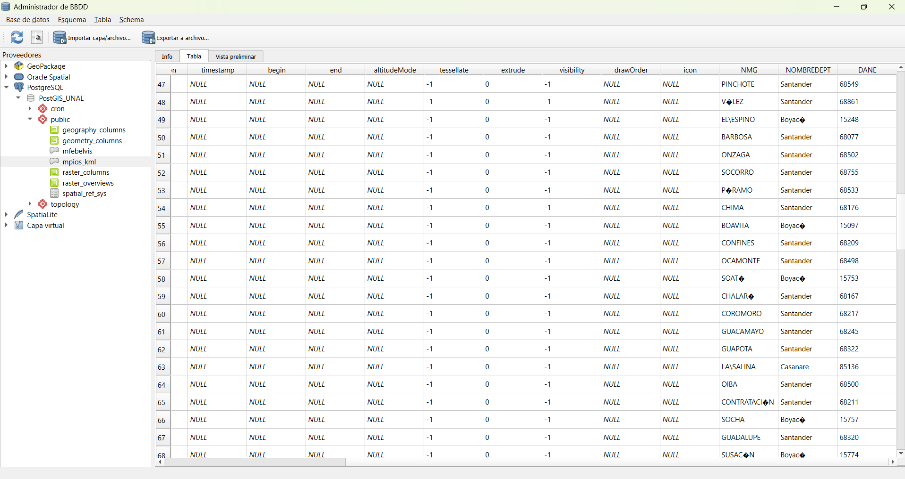

# Introducción

El presente informe documenta el flujo técnico desarrollado en los ejercicios de conversión de formatos espaciales y procesos ETL (Extract–Transform–Load). Se demuestra la capacidad de transformar datos entre modelos ráster y vector, exportar información para visualización web y cargar datos filtrados en una base de datos PostgreSQL/PostGIS.

---

# Ejercicio 1 – Sistemas de Coordenadas y KML

## ¿Por qué es un error abrir un KML con coordenadas planas en Google Earth?

El formato KML (Keyhole Markup Language) está diseñado exclusivamente para trabajar en coordenadas geográficas bajo el sistema WGS84 (EPSG:4326). Google Earth interpreta los datos asumiendo que las coordenadas están expresadas en latitud y longitud (grados).

Si un archivo es exportado en coordenadas planas (por ejemplo UTM en metros) y se intenta abrir directamente en Google Earth, las geometrías aparecerán desplazadas o completamente fuera del globo terrestre. Esto ocurre porque el visor no realiza transformación automática del sistema de referencia.

Se afirma que Google Earth no tiene “proyección al vuelo” porque no reproyecta dinámicamente capas en distintos CRS; exige que el archivo esté previamente transformado a coordenadas geográficas WGS84 antes de su visualización.

---

# Ejercicio 2 – ETL Espacial y Carga en PostGIS

## Descripción del proceso ETL

El flujo desarrollado siguió la lógica Extract – Transform – Load (ETL), aplicando reglas explícitas en cada etapa.

---

## Extract

Se utilizaron como fuentes de datos:

- MUNICIPIOS_ISLA_WGS84.shp  
- coordenadas.kml  

Ambos archivos fueron cargados en QGIS y verificados en el sistema de referencia WGS84 (EPSG:4326).

---

## Transform

La fase de transformación incluyó dos filtros aplicados en orden lógico para optimizar el procesamiento.

### 1. Filtro por atributo (Selección por Expresión)

Se excluyeron municipios con nombres compuestos (que contienen espacios en el campo NMG).

La expresión SQL utilizada en QGIS fue:

```sql
NOT "NMG" LIKE '% %'
```

Esta instrucción selecciona únicamente los registros cuyo nombre no contiene espacios, reduciendo el conjunto de datos antes del análisis espacial.

---

### 2. Filtro espacial (Buffer + Selección por Ubicación)

Dado que el cálculo de distancias requiere unidades métricas, los puntos del archivo coordenadas.kml fueron reproyectados previamente a un sistema UTM correspondiente.

Se generó un buffer de 40 km mediante la herramienta Buffer con los siguientes parámetros:

Distancia: 40000 metros  
Dissolve: Activado  
Segmentos: 20  

Posteriormente se aplicó la herramienta Seleccionar por ubicación utilizando el predicado espacial:

Seleccionar entidades que INTERSECTAN el buffer_40km

Este procedimiento permitió identificar únicamente los municipios ubicados dentro del radio de influencia definido.

---

## Justificación del orden de los filtros

Se aplicó primero el filtro por atributo debido a que las comparaciones alfanuméricas son operaciones computacionalmente ligeras. Esto reduce el número de entidades en memoria antes de ejecutar operaciones espaciales, las cuales implican cálculos geométricos y evaluación topológica más costosa en términos de procesamiento.

Al disminuir previamente el volumen de datos, se optimiza el uso de memoria y se mejora la eficiencia global del flujo ETL.

---

## Load

Las entidades resultantes fueron exportadas e importadas en PostgreSQL/PostGIS mediante el DB Manager de QGIS con la siguiente configuración:

Base de datos: sig_db_unal  
Esquema: public  
Nombre de tabla: mpios_kml  

De esta manera, el conjunto final almacenado en la base de datos cumple simultáneamente con las reglas de negocio alfanuméricas y espaciales definidas.

---

# Verificación de carga en PostGIS

La Figura siguiente muestra la tabla espacial mpios_kml almacenada en el esquema public de la base de datos PostgreSQL/PostGIS, visualizada desde el DB Manager de QGIS.

{width=80%}

En la imagen se observa que los registros cumplen con las condiciones establecidas: ausencia de nombres compuestos y localización dentro del buffer de 40 km.

---

# Reflexión sobre Interoperabilidad

Durante la carga de datos en PostgreSQL/PostGIS se evidenció que ArcGIS Pro presenta restricciones al escribir en bases de datos nativas cuando no se utiliza una Enterprise Geodatabase habilitada.

El ERROR 000210 no se relaciona con el shapefile en sí, sino con la gestión de esquemas y permisos en PostgreSQL. ArcGIS Pro intenta crear la tabla en el esquema asociado al usuario conectado, lo que puede generar conflictos si el esquema no existe o no posee los permisos adecuados.

QGIS facilita la interoperabilidad al permitir especificar directamente el esquema de destino y escribir en bases de datos PostgreSQL/PostGIS sin configuraciones adicionales. En este contexto, QGIS actúa como una herramienta puente que garantiza la transferencia efectiva de datos entre plataformas comerciales y sistemas de bases de datos espaciales abiertos.

---

# Conclusión

El desarrollo de este taller permitió comprender:

- La importancia de la correcta gestión de sistemas de coordenadas para interoperabilidad web.  
- La transición estructural entre modelos ráster y vector.  
- La eficiencia computacional en procesos ETL espaciales.  
- Las diferencias operativas entre plataformas SIG comerciales y de código abierto.  

Estos conocimientos son fundamentales en entornos profesionales donde la movilidad segura y eficiente de datos espaciales entre sistemas es una necesidad constante.