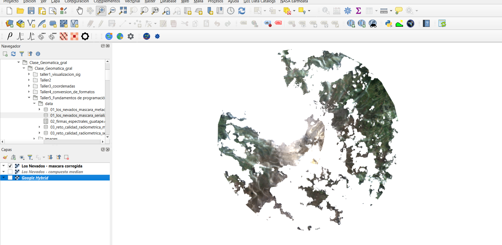
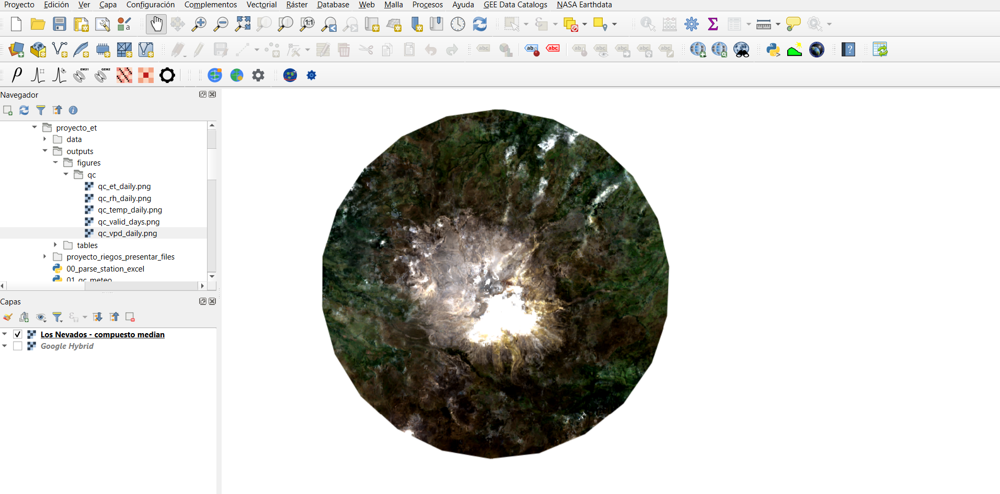
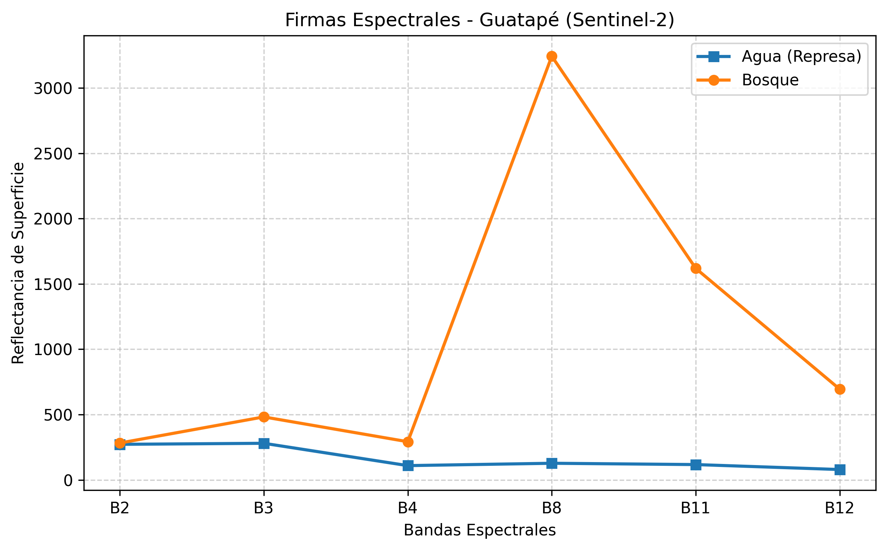

# Información general

**Estudiante:** Carlos Aguilar  
**Asignatura:** Geomática General  
**Tema:** Fundamentos de programación en Google Earth Engine (GEE) y conceptos clave de sensores remotos  

# Introducción

Google Earth Engine (GEE) es una plataforma de análisis geoespacial en la nube que permite trabajar con grandes volúmenes de datos satelitales y realizar procesamiento remoto de imágenes de manera eficiente. En este taller se abordaron conceptos fundamentales de programación en GEE, junto con principios básicos de sensores remotos, incluyendo resolución espacial, temporal, radiométrica y espectral.

El desarrollo del taller se realizó en Python, utilizando Google Earth Engine desde un entorno de trabajo local con Docker y Visual Studio Code. Además, se integraron los resultados con QGIS mediante objetos serializados en formato JSON, siguiendo la lógica planteada en la guía.

# Objetivos

- Comprender la lógica básica de trabajo en Google Earth Engine con Python.
- Aplicar conceptos de sensores remotos a imágenes satelitales Sentinel-2.
- Implementar procesos de calidad del píxel mediante máscaras de nubes y sombras.
- Extraer firmas espectrales para coberturas contrastantes.
- Generar geoprocesos serializados para integración con software SIG.
- Visualizar resultados en QGIS y elaborar una salida cartográfica.

# Entorno de trabajo

El taller se desarrolló en la siguiente ruta de trabajo:

**Ruta en Docker:**  
`/home/rstudio/work/Clase_Geomatica_gral/Clase_Geomatica_gral/Taller5_Fundamentos de programación en GEE`

**Ruta en Windows:**  
`C:\Users\ceagu\Documentos\geomatica_general\ceaguilarv\Clase_Geomatica_gral\Clase_Geomatica_gral\Taller5_Fundamentos de programación en GEE`

Se utilizó el proyecto de Google Earth Engine:

`bamboo-storm-477002-v4`

# Metodología

## 1. Máscara de nubes en Sentinel-2 para Los Nevados

En esta parte se trabajó con imágenes Sentinel-2 SR Harmonized sobre el Parque Nacional Natural Los Nevados durante 2023. Se aplicó una máscara de nubes y sombras utilizando la banda `SCL` (Scene Classification Layer), excluyendo las clases correspondientes a sombras de nube, nubes de probabilidad media, nubes de probabilidad alta y cirros.

El objetivo fue generar un primer geoproceso serializable y verificar su integración posterior en QGIS.

### Código empleado

```{python}
import ee
import json
from pathlib import Path

ee.Initialize(project="bamboo-storm-477002-v4")

base_dir = Path("/home/rstudio/work/Clase_Geomatica_gral/Clase_Geomatica_gral/Taller5_Fundamentos de programación en GEE")
data_dir = base_dir / "data"
data_dir.mkdir(exist_ok=True)

punto_nevados = ee.Geometry.Point([-75.321, 4.895])
zona_control = punto_nevados.buffer(2000)
region_exportacion = punto_nevados.buffer(12000)

def enmascarar_nubes_s2(img):
    scl = img.select("SCL")
    mascara = (
        scl.neq(3)
        .And(scl.neq(8))
        .And(scl.neq(9))
        .And(scl.neq(10))
    )
    return img.updateMask(mascara)

def agregar_pixeles_validos(img):
    img_limpia = enmascarar_nubes_s2(img)
    conteo = img_limpia.select("B4").reduceRegion(
        reducer=ee.Reducer.count(),
        geometry=zona_control,
        scale=20,
        maxPixels=1e8,
        bestEffort=True
    ).get("B4")
    return img.set("pixeles_validos_centro", conteo)

coleccion_base = (
    ee.ImageCollection("COPERNICUS/S2_SR_HARMONIZED")
    .filterBounds(punto_nevados)
    .filterDate("2023-01-01", "2023-12-31")
    .filter(ee.Filter.gt("CLOUDY_PIXEL_PERCENTAGE", 20))
)

coleccion_controlada = (
    coleccion_base
    .map(agregar_pixeles_validos)
    .filter(ee.Filter.gt("pixeles_validos_centro", 0))
    .sort("pixeles_validos_centro", False)
)

img_s2 = ee.Image(coleccion_controlada.first())
img_limpia = enmascarar_nubes_s2(img_s2).clip(region_exportacion)

metadatos = img_limpia.getInfo()
with open(data_dir / "01_los_nevados_mascara_metadata.json", "w", encoding="utf-8") as f:
    json.dump(metadatos, f, indent=2, ensure_ascii=False)

serializado = img_limpia.serialize()
with open(data_dir / "01_los_nevados_mascara_serialized.json", "w", encoding="utf-8") as f:
    f.write(serializado)

print("ID imagen elegida:", img_s2.get("system:id").getInfo())
print("Cloudy Pixel Percentage:", img_s2.get("CLOUDY_PIXEL_PERCENTAGE").getInfo())
print("Pixeles válidos:", img_s2.get("pixeles_validos_centro").getInfo())
```

## 2. Firmas espectrales en la Represa de Guatapé

Para la parte de resolución espectral se utilizaron dos puntos de muestreo: uno ubicado sobre agua en la represa de Guatapé y otro sobre cobertura de bosque cercana. Se extrajeron valores medios para las bandas B2, B3, B4, B8, B11 y B12 de Sentinel-2, permitiendo comparar el comportamiento espectral de ambas coberturas.

### Código empleado

```{python}
import ee
import pandas as pd
import matplotlib.pyplot as plt
from pathlib import Path

ee.Initialize(project="bamboo-storm-477002-v4")

base_dir = Path("/home/rstudio/work/Clase_Geomatica_gral/Clase_Geomatica_gral/Taller5_Fundamentos de programación en GEE")
data_dir = base_dir / "data"
images_dir = base_dir / "images"
data_dir.mkdir(exist_ok=True)
images_dir.mkdir(exist_ok=True)

punto_agua = ee.Geometry.Point([-75.158, 6.265])
punto_bosque = ee.Geometry.Point([-75.140, 6.275])

img_s2 = (
    ee.ImageCollection("COPERNICUS/S2_SR_HARMONIZED")
    .filterBounds(punto_agua)
    .filterDate("2023-01-01", "2023-12-31")
    .filter(ee.Filter.lt("CLOUDY_PIXEL_PERCENTAGE", 10))
    .sort("CLOUDY_PIXEL_PERCENTAGE")
    .first()
)

bandas_estudio = ["B2", "B3", "B4", "B8", "B11", "B12"]
img_espectral = img_s2.select(bandas_estudio)

valores_agua = img_espectral.reduceRegion(
    reducer=ee.Reducer.mean(),
    geometry=punto_agua,
    scale=10
).getInfo()

valores_bosque = img_espectral.reduceRegion(
    reducer=ee.Reducer.mean(),
    geometry=punto_bosque,
    scale=10
).getInfo()

df_firmas = pd.DataFrame({
    "Banda": bandas_estudio,
    "Agua": [valores_agua.get(b) for b in bandas_estudio],
    "Bosque": [valores_bosque.get(b) for b in bandas_estudio]
})

df_firmas.to_csv(data_dir / "02_firmas_espectrales_guatape.csv", index=False)

plt.figure(figsize=(8, 5))
plt.plot(df_firmas["Banda"], df_firmas["Agua"], marker="s", label="Agua (Represa)", linewidth=2)
plt.plot(df_firmas["Banda"], df_firmas["Bosque"], marker="o", label="Bosque", linewidth=2)
plt.title("Firmas Espectrales - Guatapé (Sentinel-2)")
plt.xlabel("Bandas Espectrales")
plt.ylabel("Reflectancia de Superficie")
plt.legend()
plt.grid(True, linestyle="--", alpha=0.6)
plt.tight_layout()
plt.savefig(images_dir / "02_firmas_espectrales_guatape.png", dpi=300, bbox_inches="tight")
plt.close()

df_firmas
```

## 3. Automatización de calidad radiométrica con .map() y median()

Como parte del reto planteado en el taller, se automatizó la limpieza de una colección Sentinel-2 usando la función de máscara de nubes y sombras aplicada sobre cada imagen mediante .map(). Después se generó una composición temporal con median(), obteniendo un resultado más estable y visualmente más limpio.

### Código empleado

```{python}
import ee
import json
from pathlib import Path

ee.Initialize(project="bamboo-storm-477002-v4")

base_dir = Path("/home/rstudio/work/Clase_Geomatica_gral/Clase_Geomatica_gral/Taller5_Fundamentos de programación en GEE")
data_dir = base_dir / "data"
data_dir.mkdir(exist_ok=True)

punto_nevados = ee.Geometry.Point([-75.321, 4.895])
aoi = punto_nevados.buffer(10000)

coleccion_s2 = (
    ee.ImageCollection("COPERNICUS/S2_SR_HARMONIZED")
    .filterBounds(aoi)
    .filterDate("2023-01-01", "2023-12-31")
    .filter(ee.Filter.lt("CLOUDY_PIXEL_PERCENTAGE", 80))
)

def enmascarar_nubes_s2(img):
    scl = img.select("SCL")
    mascara = (
        scl.neq(3)
        .And(scl.neq(8))
        .And(scl.neq(9))
        .And(scl.neq(10))
    )
    return img.updateMask(mascara)

coleccion_limpia = coleccion_s2.map(enmascarar_nubes_s2)
imagen_median = coleccion_limpia.median().clip(aoi)

metadatos = imagen_median.getInfo()
with open(data_dir / "03_reto_calidad_radiometrica_metadata.json", "w", encoding="utf-8") as f:
    json.dump(metadatos, f, indent=2, ensure_ascii=False)

serializado = imagen_median.serialize()
with open(data_dir / "03_reto_calidad_radiometrica_serialized.json", "w", encoding="utf-8") as f:
    f.write(serializado)

print("Imágenes en colección:", coleccion_s2.size().getInfo())
```

# Resultados

## Geoproceso 1: máscara de nubes en Los Nevados

El primer resultado correspondió a una imagen Sentinel-2 procesada mediante enmascaramiento de nubes y sombras con base en la banda SCL. Durante la validación en QGIS se observó que este producto conservó información visible, aunque con un desempeño visual más limitado que el compuesto multitemporal. Esto es consistente con el hecho de trabajar sobre una sola escena, la cual puede conservar zonas con nubosidad residual o una cobertura parcial útil después del enmascaramiento.

**Evidencia en QGIS:**



## Geoproceso 2: compuesto multitemporal tipo mediana

El segundo resultado se obtuvo mediante la aplicación de la máscara sobre toda una colección de imágenes Sentinel-2 y una reducción temporal por mediana. Este producto mostró un mejor comportamiento visual en QGIS, al reducir significativamente la presencia de nubes, sombras y variaciones atmosféricas entre escenas.

**Evidencia en QGIS:**



## Firmas espectrales agua vs bosque

Las firmas espectrales extraídas en la represa de Guatapé permitieron observar diferencias claras entre agua y bosque. El agua presentó valores bajos en el infrarrojo cercano y en el infrarrojo de onda corta, mientras que el bosque mostró una respuesta más alta en el infrarrojo cercano, característica típica de vegetación sana.

**Figura de firmas espectrales:**



## Integración en QGIS

Para la integración con QGIS se emplearon los archivos serializados generados en formato JSON. La visualización se realizó mediante reconstrucción del objeto de Earth Engine y carga como capa raster XYZ a partir de la URL de teselas. Durante la validación se identificó que el geoproceso basado en mediana ofreció mejores resultados de visualización que la escena individual enmascarada, lo cual refuerza la utilidad de las composiciones multitemporales para análisis y cartografía.

Los archivos empleados fueron:

- `data/01_los_nevados_mascara_serialized.json`
- `data/03_reto_calidad_radiometrica_serialized.json`

## Salida cartográfica final

Se elaboró una salida cartográfica final en QGIS utilizando el compuesto multitemporal de Los Nevados, proyectado en MAGNA-SIRGAS / Origen-Nacional (EPSG:9377), incluyendo título, leyenda, barra de escala, norte y grilla de coordenadas.

**Mapa final:**


### Descripción del mapa

Este mapa presenta un compuesto multitemporal de imágenes Sentinel-2 SR Harmonized correspondiente al año 2023 para el Parque Nacional Natural Los Nevados. El procesamiento se realizó en Google Earth Engine aplicando una máscara de nubes y sombras a partir de la banda Scene Classification Layer (SCL), con el fin de excluir píxeles afectados por nubosidad, cirros y sombras de nube. Posteriormente, se generó una composición estadística mediante la mediana temporal, lo que permitió reducir la persistencia de artefactos atmosféricos y obtener una representación más homogénea de la superficie. La visualización se muestra en composición color natural (bandas B4, B3 y B2), adecuada para la interpretación general de coberturas y rasgos del paisaje de alta montaña.

# Discusión

Los resultados muestran que la calidad visual y analítica de un producto satelital depende en gran medida de la estrategia de preprocesamiento utilizada. El uso de una máscara de nubes sobre una sola escena permite limpiar parcialmente la imagen, pero no siempre garantiza una cobertura espacial homogénea. En contraste, la aplicación de la misma lógica sobre una colección completa y su posterior reducción por mediana produce un resultado más robusto para fines cartográficos y de interpretación visual.

De igual forma, el análisis de firmas espectrales evidenció el valor de la resolución espectral para discriminar coberturas. En particular, la diferencia entre agua y vegetación fue más evidente en el infrarrojo cercano y el infrarrojo de onda corta, lo que confirma principios fundamentales de sensores remotos revisados en clase.

# Conclusiones

- Google Earth Engine permite realizar procesamiento geoespacial reproducible y escalable sobre colecciones satelitales.
- La banda SCL de Sentinel-2 es útil para implementar máscaras de nubes y sombras de forma directa.
- Los compuestos multitemporales mediante mediana generan productos más robustos que una sola escena enmascarada.
- Las firmas espectrales permiten diferenciar coberturas con base en su respuesta en distintas bandas.
- La integración de objetos serializados con QGIS constituye una estrategia útil para llevar geoprocesos de GEE a entornos SIG de escritorio.

# Entregables generados

## Archivos de datos

- `data/01_los_nevados_mascara_metadata.json`
- `data/01_los_nevados_mascara_serialized.json`
- `data/02_firmas_espectrales_guatape.csv`
- `data/03_reto_calidad_radiometrica_metadata.json`
- `data/03_reto_calidad_radiometrica_serialized.json`

## Evidencias gráficas

- `images/02_firmas_espectrales_guatape.png`
- `images/qgis_01_los_nevados_mascara_corregida.png`
- `images/qgis_02_los_nevados_compuesto_median.png`
- `images/mapa_qgis_los_nevados.png`
- `images/mapa_qgis_los_nevados.pdf`