# Información general

**Estudiante:** Carlos Aguilar  
**Asignatura:** Geomática General  
**Tema:** Modelos Digitales de Elevación (MDE), interpolación espacial y derivados topográficos  

# Introducción

Los Modelos Digitales de Elevación (MDE) constituyen una herramienta fundamental para el análisis del relieve, la geomorfología y la representación espacial del terreno. En geomática, su construcción puede realizarse tanto a partir de datos raster globales, como SRTM, como mediante interpolación de observaciones puntuales de elevación. Este taller abordó ambas aproximaciones: por un lado, la generación de superficies interpoladas a partir de una ruta altimétrica y, por otro, el uso de un MDE satelital de referencia para derivar variables topográficas.

El área de estudio seleccionada fue la localidad de Usme, en Bogotá, debido a su relieve montañoso y a su conexión territorial con sectores de alta montaña e influencia del páramo de Sumapaz. Esta condición la convierte en un espacio adecuado para analizar variaciones altitudinales, sombreado del relieve y derivados como pendiente y aspecto.

# Objetivos

- Delimitar un área de estudio con relieve significativo en la localidad de Usme.
- Construir una ruta altimétrica y convertir sus vértices en puntos de elevación.
- Generar un MDE interpolado mediante el método IDW.
- Generar una segunda superficie interpolada mediante B-Spline.
- Elaborar salidas cartográficas del relieve interpolado.
- Exportar desde Google Earth Engine un MDE SRTM y sus derivados topográficos.
- Comparar visual y metodológicamente los productos obtenidos.

# Área de estudio

El área de estudio corresponde a la localidad de Usme, Bogotá, en un contexto de transición urbano-rural y con presencia de relieve montañoso. Para el desarrollo del taller se utilizó un polígono vectorial delimitando la totalidad de la localidad, que posteriormente fue exportado a KML y empleado como referencia en Google Earth Pro y QGIS.

**Polígono base del estudio:** `data/area_estudio_usme.gpkg`

# Metodología

## 1. Delimitación del área de estudio

Se utilizó un polígono vectorial correspondiente al área de estudio en Usme, almacenado en formato GeoPackage. Posteriormente, la capa fue exportada a formato KML para su visualización en Google Earth Pro.

**Archivo principal:**
- `data/area_estudio_usme.gpkg`
- `data/area_estudio_usme.kml`

**Evidencia:**

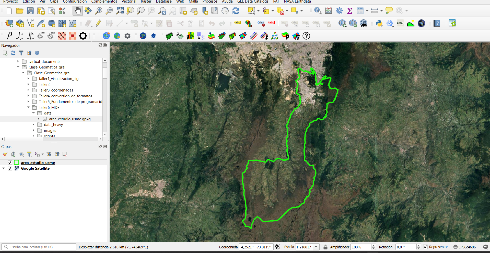

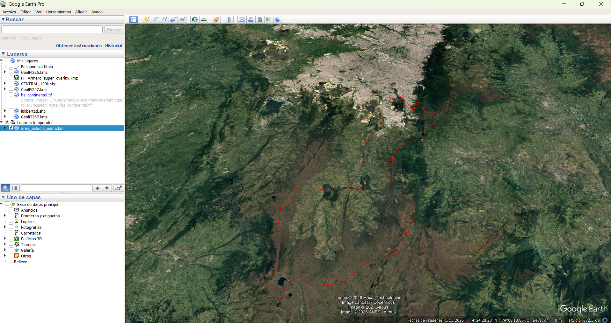

## 2. Trazado de ruta altimétrica y extracción de puntos

En Google Earth Pro se trazó una ruta altimétrica al interior del polígono del área de estudio. Esta ruta fue exportada en formato KML y posteriormente convertida a GPX. Luego, en QGIS, se importó el archivo GPX y se extrajeron sus vértices para construir una capa puntual de elevaciones.

**Archivos generados:**
- `data/ruta_altimetrica_usme.kml`
- `data/ruta_altimetrica_usme.gpx`
- `data/puntos_ruta_altimetrica_usme.gpkg`

**Evidencia:**

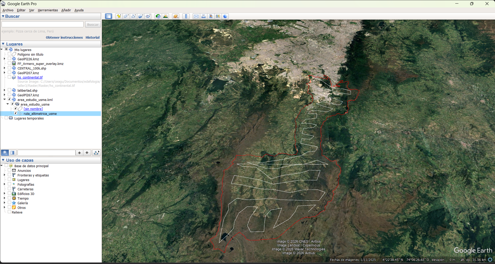

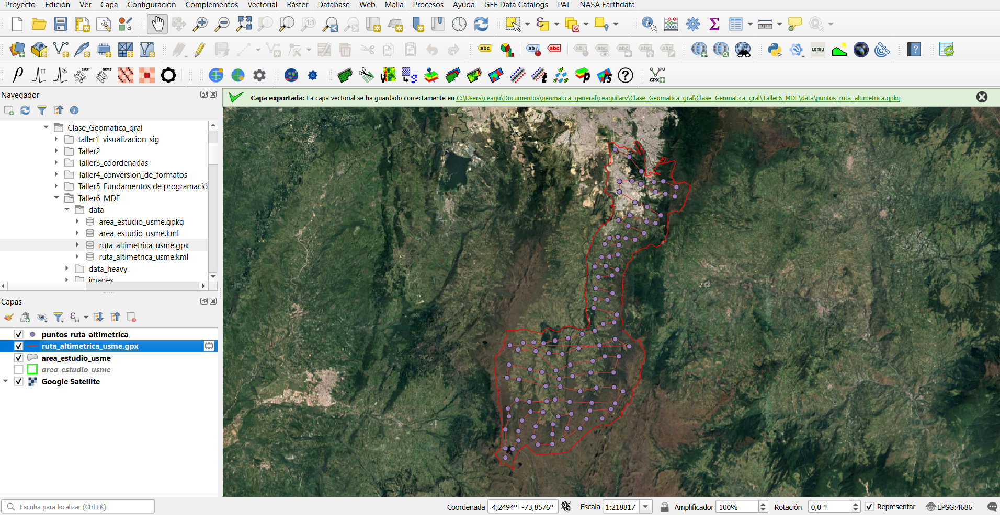

## 3. Reproyección a MAGNA-SIRGAS / Origen-Nacional

Con el fin de realizar interpolaciones y análisis métricos en unidades de metros, tanto el polígono del área de estudio como la capa de puntos fueron reproyectados al sistema oficial **MAGNA-SIRGAS / Origen-Nacional (EPSG:9377)**.

**Archivos generados:**
- `data/area_estudio_usme_9377.gpkg`
- `data/puntos_ruta_altimetrica_usme_9377.gpkg`

**Evidencia:**

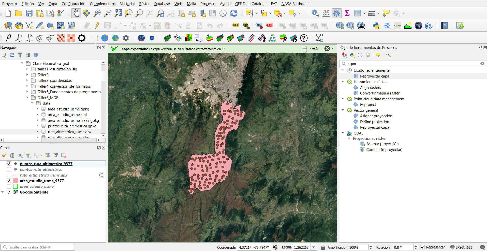

## 4. Interpolación del MDE mediante IDW

A partir de la capa de puntos de elevación reproyectada, se generó una superficie interpolada usando el método **Inverse Distance Weighting (IDW)**. Para la interpolación se empleó el campo de elevación `ele`, un tamaño de celda de 30 metros y la extensión del área de estudio.

**Raster generado:**
- `data_heavy/raster/mde_idw_usme_9377.tif`

El resultado inicial se visualizó en escala de grises y posteriormente se aplicó una simbología hipsométrica para su representación cartográfica.

**Evidencia inicial del raster:**

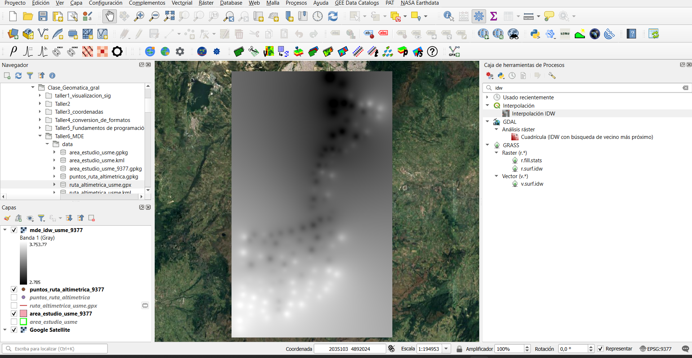

## 5. Salida cartográfica del MDE IDW

Se diseñó una salida cartográfica en QGIS a partir del MDE interpolado por IDW. En el diseño de impresión se incluyeron los elementos cartográficos básicos: título, subtítulo, leyenda, barra de escala, flecha norte, grilla y cuadro descriptivo.

### Nombre de capas en el diseño

- **Área de estudio**
- **Puntos de elevación**
- **MDE interpolado (IDW)**

### Título del mapa

**Modelo Digital de Elevación de Usme**

### Subtítulo del mapa

**Interpolación IDW a partir de puntos de elevación derivados de una ruta altimétrica**

### Descripción cartográfica

Este mapa presenta un Modelo Digital de Elevación (MDE) interpolado para un sector de la localidad de Usme, Bogotá. La superficie fue generada mediante el método IDW a partir de puntos de elevación obtenidos desde una ruta altimétrica y proyectados en el sistema MAGNA-SIRGAS / Origen-Nacional (EPSG:9377). El resultado permite representar la variación del relieve y constituye una base para posteriores análisis geomorfológicos.

**Salidas exportadas:**
- `images/mapa_mde_idw_usme.png`
- `images/mapa_mde_idw_usme.pdf`

**Mapa final IDW:**

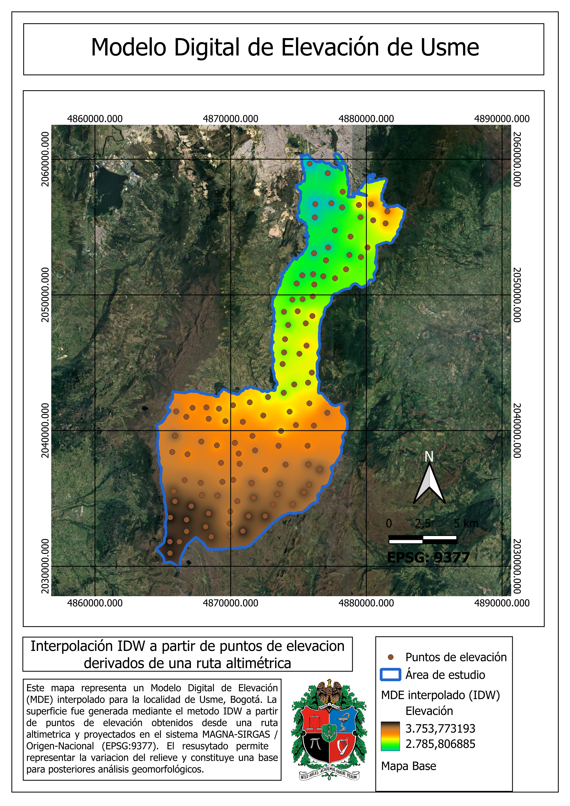

## 6. Generación de hillshade del MDE IDW

Con el propósito de mejorar la lectura del relieve, se generó un sombreado del terreno a partir del raster interpolado IDW. Se utilizaron parámetros clásicos de iluminación: azimut 315°, altitud solar 45° y factor Z igual a 1.

**Raster generado:**
- `data_heavy/raster/hillshade_idw_usme_9377.tif`

**Evidencia:**

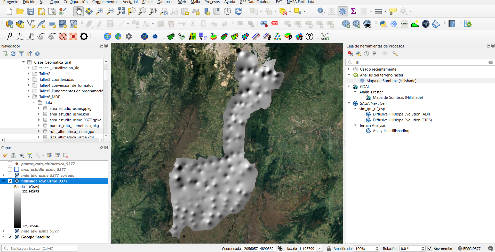

## 7. Interpolación del MDE mediante B-Spline

Como método alternativo y más suavizado, se construyó una segunda superficie de elevación mediante interpolación **B-Spline**. Esta aproximación permite una representación más continua del relieve y reduce la apariencia escalonada o puntual que puede observarse con otros métodos.

**Raster generado:**
- `data_heavy/raster/mde_bspline_usme_9377.tif`

### Título del mapa

**Modelo Digital de Elevación de Usme**

### Subtítulo del mapa

**Interpolación B-Spline a partir de puntos de elevación derivados de una ruta altimétrica**

### Descripción cartográfica

Este mapa presenta un Modelo Digital de Elevación interpolado mediante B-Spline para un sector de la localidad de Usme, Bogotá. La superficie fue generada a partir de puntos de elevación obtenidos desde una ruta altimétrica y proyectados en MAGNA-SIRGAS / Origen-Nacional (EPSG:9377). El método B-Spline permite obtener una representación más continua y suavizada del relieve.

**Salidas exportadas:**
- `images/mapa_mde_bspline_usme.png`
- `images/mapa_mde_bspline_usme.pdf`

**Vista del raster B-Spline:**

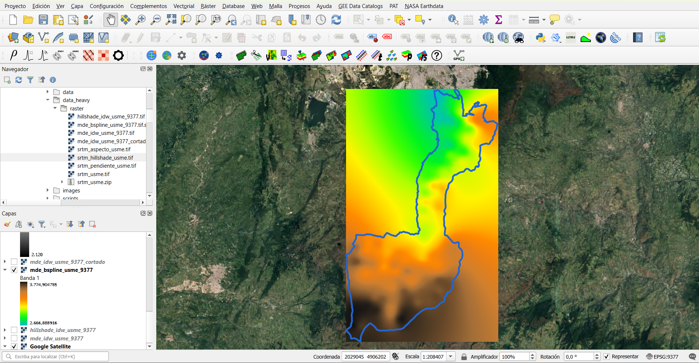

**Mapa final B-Spline:**

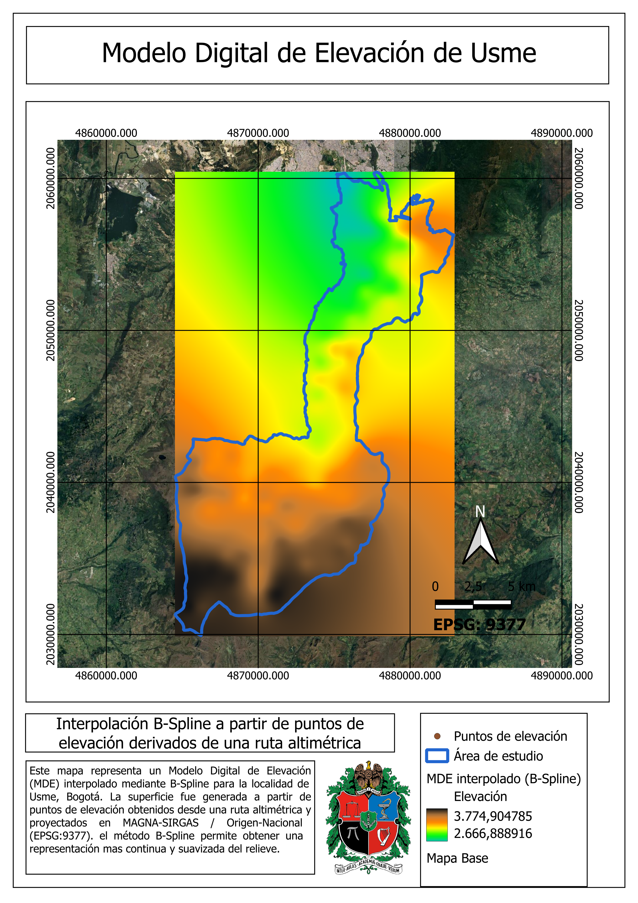

## 8. Exportación de SRTM y derivados desde Google Earth Engine

Como complemento al análisis interpolado, se exportó un Modelo Digital de Elevación SRTM desde Google Earth Engine, utilizando como región de recorte el polígono real del área de estudio en Usme. A partir de este DEM se generaron tres derivados topográficos:

- pendiente
- aspecto
- hillshade

### Código empleado

```{python}
import ee
import geemap
import geopandas as gpd
from pathlib import Path

ee.Initialize(project="bamboo-storm-477002-v4")

base_dir = Path("/home/rstudio/work/Clase_Geomatica_gral/Clase_Geomatica_gral/Taller6_MDE")
data_dir = base_dir / "data"
raster_dir = base_dir / "data_heavy" / "raster"
raster_dir.mkdir(parents=True, exist_ok=True)

gpkg_path = data_dir / "area_estudio_usme.gpkg"
gdf = gpd.read_file(gpkg_path, layer="area_estudio_usme")

if gdf.crs is None:
    raise ValueError("La capa no tiene CRS definido.")

gdf_wgs84 = gdf.to_crs("EPSG:4326")
aoi = geemap.geopandas_to_ee(gdf_wgs84)

srtm = ee.Image("USGS/SRTMGL1_003").clip(aoi)
pendiente = ee.Terrain.slope(srtm).clip(aoi)
aspecto = ee.Terrain.aspect(srtm).clip(aoi)
sombreado = ee.Terrain.hillshade(srtm).clip(aoi)

region = aoi.geometry()

geemap.ee_export_image(
    srtm,
    filename=str(raster_dir / "srtm_usme.tif"),
    scale=30,
    region=region,
    file_per_band=False
)

geemap.ee_export_image(
    pendiente,
    filename=str(raster_dir / "srtm_pendiente_usme.tif"),
    scale=30,
    region=region,
    file_per_band=False
)

geemap.ee_export_image(
    aspecto,
    filename=str(raster_dir / "srtm_aspecto_usme.tif"),
    scale=30,
    region=region,
    file_per_band=False
)

geemap.ee_export_image(
    sombreado,
    filename=str(raster_dir / "srtm_hillshade_usme.tif"),
    scale=30,
    region=region,
    file_per_band=False
)

print("Exportación completada con el polígono real de Usme.")
```

## 9. Resultados del SRTM y derivados topográficos

Los productos derivados del SRTM permitieron complementar la lectura del relieve a escala regional y comparar un modelo global con los MDE generados por interpolación local.

**Rasters generados:**
- `data_heavy/raster/srtm_usme.tif`
- `data_heavy/raster/srtm_pendiente_usme.tif`
- `data_heavy/raster/srtm_aspecto_usme.tif`
- `data_heavy/raster/srtm_hillshade_usme.tif`

**Evidencias:**

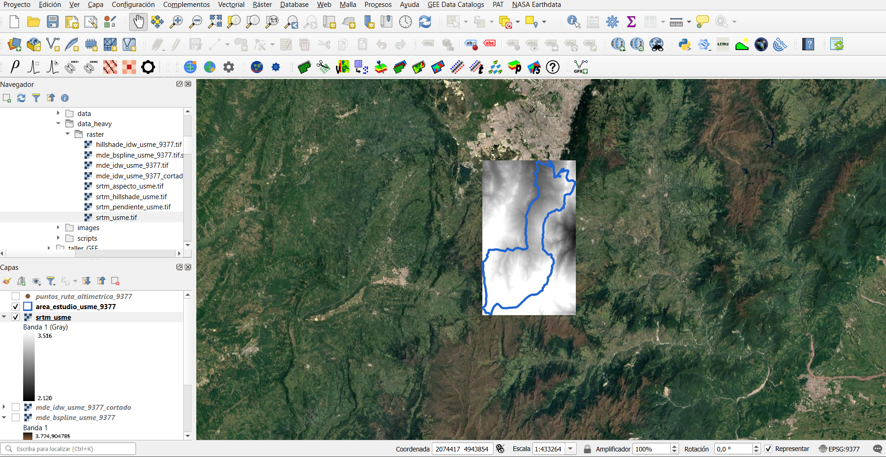

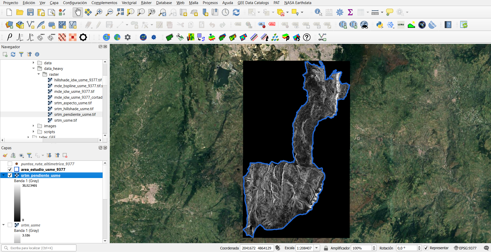

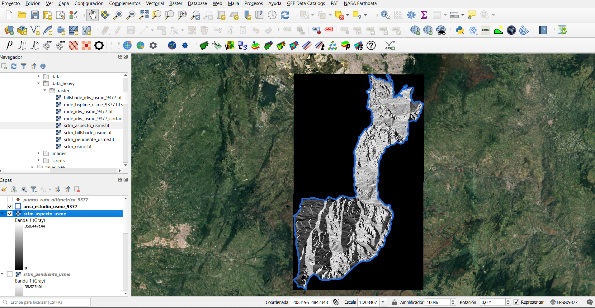

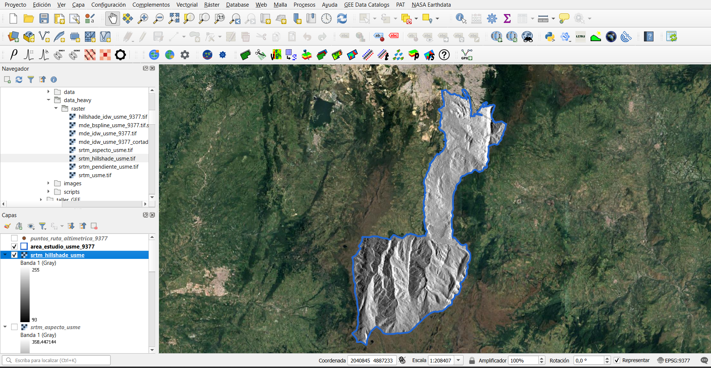

# Discusión

Los resultados muestran diferencias metodológicas claras entre los MDE interpolados a partir de observaciones puntuales y el DEM SRTM derivado de una fuente satelital global. El método IDW permitió construir una superficie de relieve directamente vinculada a los puntos de elevación de la ruta altimétrica, aunque con una dependencia fuerte de la distribución espacial de dichos puntos. En contraste, el método B-Spline produjo una representación más continua y suavizada del relieve, favoreciendo una lectura más estética y cartográfica de la superficie.

Por otra parte, el SRTM proporcionó una referencia topográfica regional completa y continua para toda la localidad de Usme, lo que permitió derivar variables como pendiente, aspecto y hillshade. Estos productos son especialmente útiles para análisis geomorfológicos, hidrológicos y territoriales, y complementan el ejercicio de interpolación local desarrollado en QGIS.

# Conclusiones

- La localidad de Usme constituye un área adecuada para el análisis del relieve por su configuración montañosa y variación altitudinal.
- La interpolación IDW permite construir un MDE a partir de puntos de elevación, aunque su resultado depende de la distribución espacial de los datos.
- La interpolación B-Spline ofrece una representación más suavizada y visualmente continua del terreno.
- El hillshade mejora la interpretación geomorfológica al resaltar la forma del relieve mediante sombreado.
- Los derivados topográficos del SRTM, como pendiente y aspecto, enriquecen el análisis del terreno y permiten comparar productos interpolados locales con modelos globales.
- La combinación de QGIS, Google Earth Pro y Google Earth Engine ofrece un flujo de trabajo robusto para la construcción y análisis de modelos digitales de elevación.

# Entregables generados

## Archivos vectoriales

- `data/area_estudio_usme.gpkg`
- `data/area_estudio_usme.kml`
- `data/ruta_altimetrica_usme.kml`
- `data/ruta_altimetrica_usme.gpx`
- `data/puntos_ruta_altimetrica_usme.gpkg`
- `data/area_estudio_usme_9377.gpkg`
- `data/puntos_ruta_altimetrica_usme_9377.gpkg`

## Archivos raster

- `data_heavy/raster/mde_idw_usme_9377.tif`
- `data_heavy/raster/hillshade_idw_usme_9377.tif`
- `data_heavy/raster/mde_bspline_usme_9377.tif`
- `data_heavy/raster/srtm_usme.tif`
- `data_heavy/raster/srtm_pendiente_usme.tif`
- `data_heavy/raster/srtm_aspecto_usme.tif`
- `data_heavy/raster/srtm_hillshade_usme.tif`

## Evidencias gráficas

- `images/01_area_estudio_usme_qgis.png`
- `images/02_area_estudio_usme_google_earth.png`
- `images/03_ruta_altimetrica_usme_google_earth.png`
- `images/04_puntos_ruta_altimetrica_usme_qgis.png`
- `images/05_capas_reproyectadas_9377.png`
- `images/06_mde_idw_usme_grises_qgis.png`
- `images/mapa_mde_idw_usme.png`
- `images/mapa_mde_idw_usme.pdf`
- `images/08_hillshade_idw_usme_qgis.png`
- `images/09_mde_bspline_usme_qgis.png`
- `images/mapa_mde_bspline_usme.png`
- `images/mapa_mde_bspline_usme.pdf`
- `images/10_srtm_usme_qgis.png`
- `images/11_srtm_pendiente_usme_qgis.png`
- `images/12_srtm_aspecto_usme_qgis.png`
- `images/13_srtm_hillshade_usme_qgis.png`