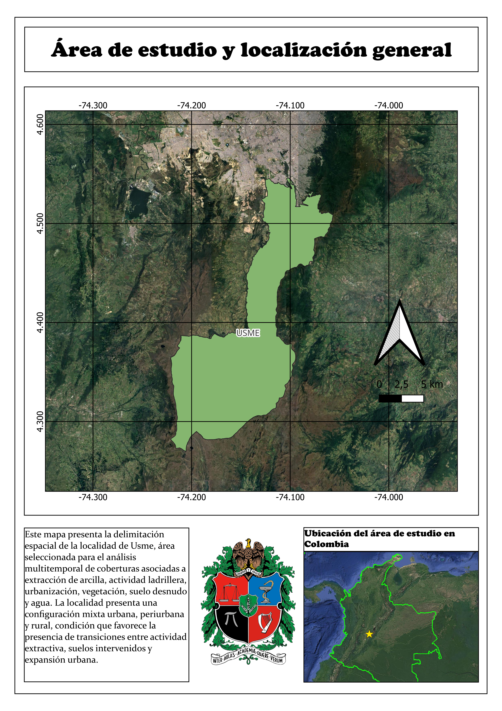
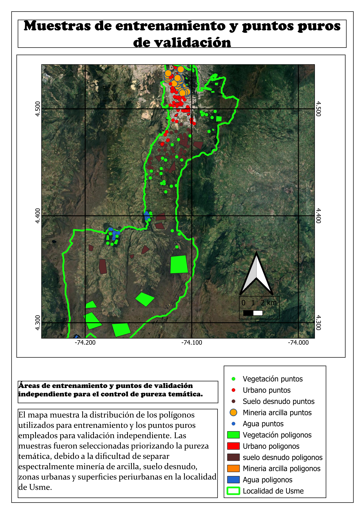
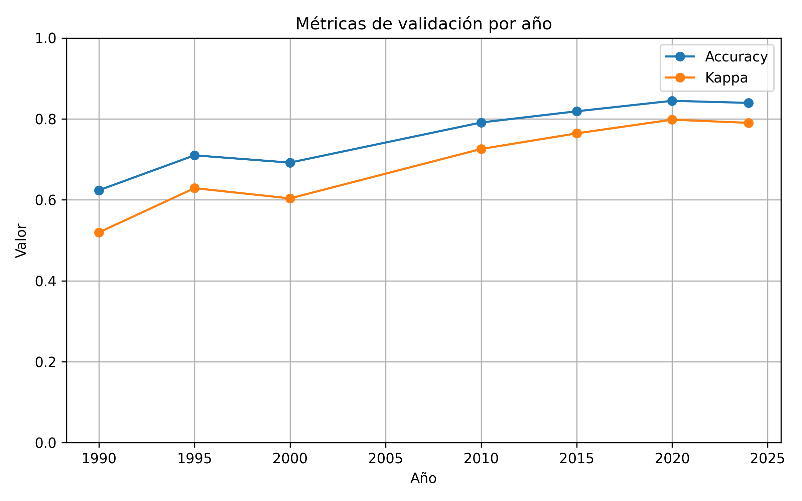
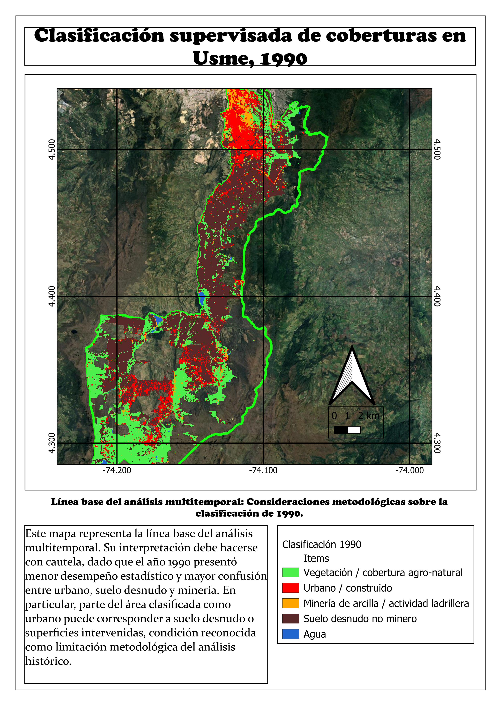
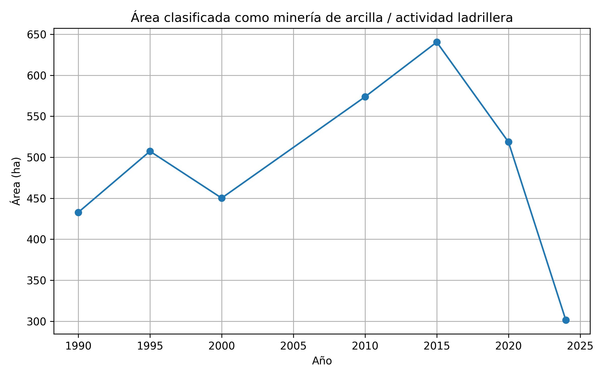
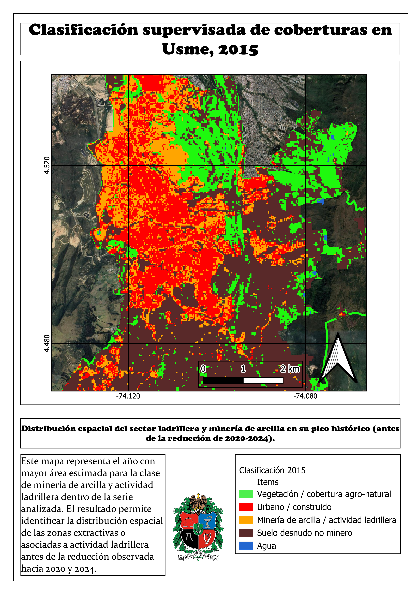
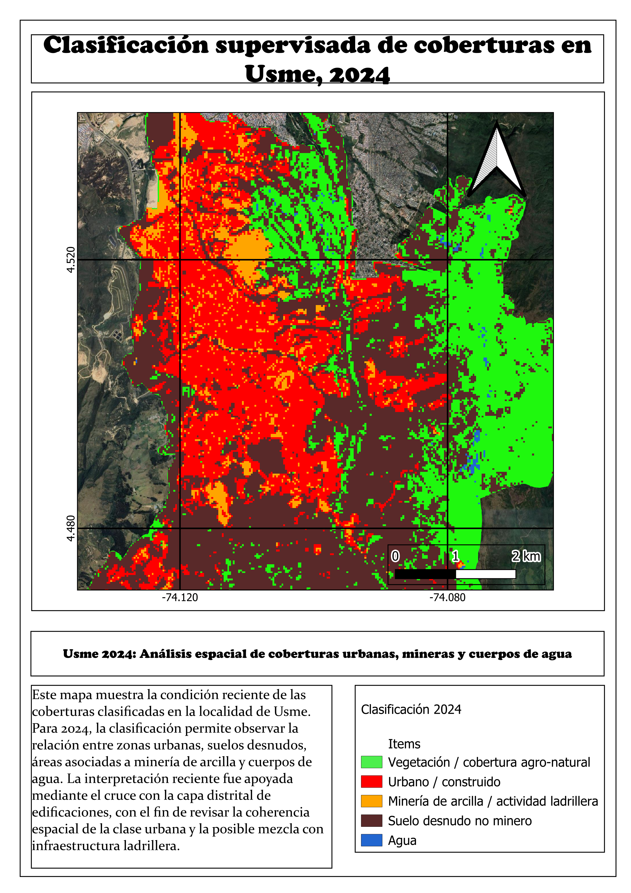
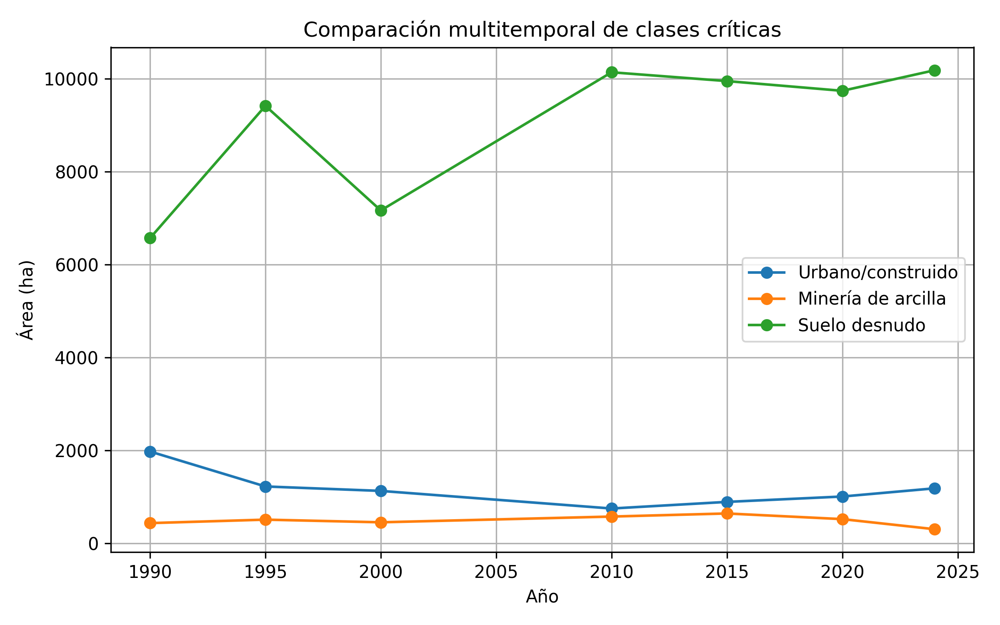
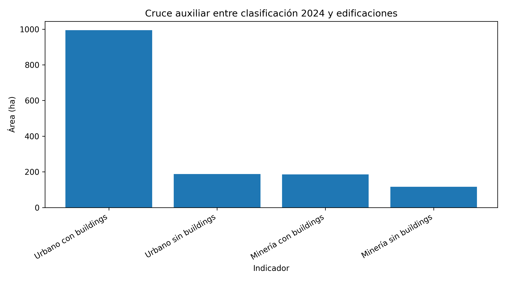
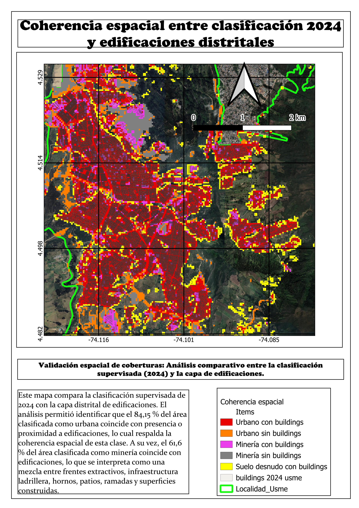

```{r setup}
knitr::opts_chunk$set(
  echo = FALSE,
  warning = FALSE,
  message = FALSE,
  fig.align = "center"
)
```

# Resumen

La localidad de Usme, ubicada en el suroriente de Bogotá D.C., ha experimentado transformaciones territoriales asociadas a la extracción de arcilla, la actividad ladrillera, la expansión urbana, la presencia de suelo desnudo y procesos de revegetalización o cierre de frentes extractivos. Este trabajo analiza la dinámica multitemporal de áreas asociadas a extracción de arcilla y actividad ladrillera durante el periodo 1990--2024, mediante imágenes Landsat procesadas en Google Earth Engine y Python.

La metodología se basó en la construcción de mosaicos multitemporales para los años 1990, 1995, 2000, 2010, 2015, 2020 y 2024, el cálculo de variables espectrales e índices como NDVI, NDBI y BSI, y la aplicación de clasificación supervisada mediante Random Forest. Se definieron cinco clases temáticas: vegetación o cobertura agro-natural, urbano/construido, minería de arcilla o actividad ladrillera, suelo desnudo no minero y agua. La clasificación fue entrenada con polígonos de referencia y validada con puntos puros independientes. Adicionalmente, para el año 2024 se desarrolló un análisis auxiliar de coherencia espacial entre la clasificación obtenida y una capa distrital de edificaciones.

Los resultados muestran una dinámica no lineal de la clase asociada a minería de arcilla, con incremento entre 1990 y 2015, año en el que se estimó la mayor extensión, seguido por una reducción hacia 2020 y 2024. Esta reducción no debe interpretarse únicamente como desaparición de la actividad extractiva, sino como una transición territorial compleja que incluye cierre de frentes, revegetalización superficial, intervenciones de bioingeniería, permanencia de infraestructura ladrillera y expansión urbana sobre áreas previamente intervenidas. Desde una perspectiva de gestión del riesgo, estos resultados permiten identificar zonas donde la transformación de antiguos terrenos mineros hacia usos urbanos requiere análisis posteriores sobre estabilidad, drenaje, compactación y susceptibilidad a procesos de remoción en masa.

**Palabras clave:** teledetección, Google Earth Engine, Random Forest, minería de arcilla, ladrilleras, Usme, Landsat, gestión del riesgo.

# Abstract

The locality of Usme, located in southeastern Bogotá D.C., has experienced territorial transformations associated with clay extraction, brick-making activity, urban expansion, bare soil surfaces, and revegetation or closure processes of former extraction fronts. This study analyzes the multitemporal dynamics of areas associated with clay extraction and brick-making activity during the 1990--2024 period using Landsat imagery processed through Google Earth Engine and Python.

The methodology was based on the construction of multitemporal mosaics for the years 1990, 1995, 2000, 2010, 2015, 2020 and 2024, the calculation of spectral variables and indices such as NDVI, NDBI and BSI, and the application of supervised classification using Random Forest. Five thematic classes were defined: vegetation or agro-natural cover, urban/built-up areas, clay mining or brick-making activity, non-mining bare soil, and water. The classification was trained with reference polygons and validated with independent pure points. Additionally, for 2024, an auxiliary spatial coherence analysis was performed between the classification output and an official district building layer.

The results show a non-linear dynamic of the clay mining class, with an increase between 1990 and 2015, followed by a reduction toward 2020 and 2024. This reduction should not be interpreted solely as the disappearance of extractive activity, but rather as a complex territorial transition involving closure of extraction fronts, superficial revegetation, bioengineering interventions, remaining brick-making infrastructure, and urban expansion over previously disturbed areas. From a risk management perspective, these findings help identify zones where the transformation of former mining areas into urban uses requires further analysis related to slope stability, drainage, soil compaction, and susceptibility to mass movement processes.

**Keywords:** remote sensing, Google Earth Engine, Random Forest, clay mining, brick-making, Usme, Landsat, risk management.

# Introducción

La localidad de Usme, en el suroriente de Bogotá D.C., constituye un territorio estratégico para comprender las relaciones entre expansión urbana, actividades extractivas, transformación de coberturas y gestión del riesgo. Su configuración espacial combina áreas urbanas consolidadas, sectores periurbanos en proceso de ocupación, zonas rurales, coberturas agropecuarias, cuerpos de agua y sectores históricamente vinculados con la extracción de arcilla para la producción de ladrillo.

La actividad ladrillera ha sido parte de la historia territorial de Usme y ha dejado huellas visibles en el paisaje. Estas huellas se expresan en frentes de extracción, superficies expuestas, patios de almacenamiento, hornos, ramadas, infraestructura industrial, modificación de laderas, cambios en la cobertura vegetal y, en algunos casos, posterior ocupación urbana de terrenos previamente alterados. En sectores como los asociados a Ladrillera Santa Fe, Ladrillera Brasilia, Ladrillera Alemana y Ladrillera Santa Librada, la relación entre extracción de arcilla, cierre de frentes y urbanización posterior permite observar dinámicas territoriales complejas.

Desde una perspectiva geomática, el seguimiento multitemporal de estas transformaciones requiere fuentes de información consistentes en el tiempo. La serie Landsat permite analizar cambios de cobertura durante varias décadas, debido a su continuidad histórica, disponibilidad abierta y cobertura global. Al integrar estas imágenes con plataformas como Google Earth Engine, lenguajes de programación como Python y algoritmos de aprendizaje automático como Random Forest, es posible construir flujos reproducibles para clasificar coberturas y cuantificar cambios espaciales.

No obstante, el análisis de áreas asociadas a extracción de arcilla presenta desafíos metodológicos. Las superficies mineras, los suelos desnudos, las vías no pavimentadas, los barrios periurbanos, las zonas en construcción y la infraestructura ladrillera pueden presentar respuestas espectrales similares. En Usme, esta dificultad aumenta por la presencia de barrios en desarrollo, calles sin pavimentar, potreros con suelo arado, pastos secos y áreas donde la industria minera ha cedido o transformado espacios posteriormente ocupados por urbanización.

En este contexto, el presente trabajo desarrolla un análisis multitemporal de la expansión y transformación de áreas asociadas a extracción de arcilla y actividad ladrillera en la localidad de Usme durante el periodo 1990--2024. El enfoque combina clasificación supervisada, índices espectrales, validación independiente y análisis auxiliar de edificaciones recientes. La interpretación se orienta no solo a cuantificar áreas clasificadas como minería, sino también a discutir las transiciones territoriales entre actividad extractiva, suelo desnudo, revegetalización, infraestructura ladrillera y expansión urbana, con énfasis en su relevancia para la gestión del riesgo.

# Planteamiento del problema

La extracción de arcilla y la actividad ladrillera han producido transformaciones acumulativas en la localidad de Usme. Estas transformaciones incluyen remoción de material, alteración de laderas, generación de superficies expuestas, aparición de patios e infraestructura productiva, pérdida o modificación de coberturas vegetales y cambios posteriores hacia usos urbanos o periurbanos.

A pesar de la relevancia de este fenómeno, persiste la necesidad de caracterizar de manera espacial y multitemporal cómo han cambiado las áreas asociadas a extracción de arcilla y actividad ladrillera en la localidad. No basta con identificar la presencia de ladrilleras o frentes extractivos en un momento específico; es necesario analizar su dinámica temporal, los posibles periodos de expansión o reducción, y su relación con otras coberturas como urbano, suelo desnudo, vegetación y agua.

El problema adquiere mayor importancia desde el enfoque de gestión del riesgo. La ocupación urbana de terrenos previamente intervenidos por minería puede implicar condiciones particulares de estabilidad, drenaje, compactación, relleno, erosión y susceptibilidad a procesos de remoción en masa. Aunque este trabajo no desarrolla un análisis geotécnico ni de amenaza, sí permite identificar espacialmente zonas de transición entre minería, suelo desnudo y urbanización reciente, que pueden orientar estudios posteriores.

Por tanto, la pregunta que guía el trabajo es:

> ¿Cómo ha cambiado espacial y temporalmente la extensión de las áreas asociadas a la extracción de arcilla y actividad ladrillera en la localidad de Usme durante el periodo 1990--2024?

# Hipótesis de trabajo

Las áreas asociadas a extracción de arcilla en la localidad de Usme han presentado una dinámica espacial significativa durante las últimas décadas, caracterizada por fases de expansión, cierre, revegetalización superficial y transición hacia usos urbanos o periurbanos. Esta dinámica puede ser identificada y cuantificada mediante clasificación supervisada de imágenes Landsat multitemporales procesadas en Google Earth Engine con apoyo de Python.

# Objetivos

## Objetivo general

Analizar la dinámica espacio-temporal de las áreas asociadas a extracción de arcilla y actividad ladrillera en la localidad de Usme, Bogotá, durante el periodo 1990--2024, mediante imágenes satelitales multitemporales, Google Earth Engine, Python y clasificación supervisada con Random Forest.

## Objetivos específicos

1. Delimitar el área de estudio e identificar sectores con presencia histórica o reciente de actividad extractiva y ladrillera en la localidad de Usme.

2. Construir una serie temporal de imágenes Landsat y derivar variables espectrales útiles para diferenciar vegetación, urbano/construido, minería de arcilla, suelo desnudo y agua.

3. Aplicar una clasificación supervisada basada en Random Forest para estimar la distribución espacial de las coberturas seleccionadas en distintos cortes temporales.

4. Cuantificar la variación temporal de las áreas clasificadas como minería de arcilla o actividad ladrillera entre 1990 y 2024.

5. Evaluar la coherencia espacial de la clase urbano/construido para 2024 mediante una capa auxiliar de edificaciones del Distrito.

6. Discutir los resultados desde una perspectiva de transformación territorial y gestión del riesgo.

# Área de estudio

El área de estudio corresponde a la localidad de Usme, una de las veinte localidades de Bogotá D.C., ubicada en el sector suroriental de la ciudad. Usme presenta una configuración territorial mixta, con zonas urbanas, periurbanas, rurales, áreas de montaña, coberturas agropecuarias, cuerpos de agua y sectores históricamente asociados a extracción de arcilla y producción ladrillera.

La elección de la localidad de Usme responde a la presencia de varios puntos afectados por actividad extractiva, por lo cual el análisis se desarrolló a escala de localidad y no únicamente sobre un barrio o sector puntual. Esta decisión permitió abordar el fenómeno de manera integral, considerando la distribución espacial de la actividad ladrillera y su relación con procesos de urbanización, revegetalización y suelo desnudo.

```{r mapa-area-estudio, fig.cap="Mapa 1. Área de estudio y localización general de la localidad de Usme, Bogotá D.C.", out.width="85%"}

```

# Marco conceptual

## Teledetección y análisis multitemporal de coberturas

La teledetección permite observar la superficie terrestre mediante sensores remotos instalados en plataformas satelitales. En estudios de cobertura y uso del suelo, las imágenes multiespectrales permiten identificar patrones asociados a vegetación, agua, áreas urbanas, suelos expuestos y superficies intervenidas. Cuando estas observaciones se organizan en series temporales, es posible analizar cambios espaciales y cuantificar transformaciones acumulativas.

La serie Landsat es especialmente útil para análisis multitemporales de largo plazo debido a su continuidad histórica desde la década de 1970, su resolución espacial de 30 m en bandas ópticas y su disponibilidad abierta. En este trabajo, Landsat se empleó como fuente principal para garantizar consistencia temporal entre los años analizados.

## Clasificación supervisada y aprendizaje automático

La clasificación supervisada consiste en entrenar un algoritmo mediante muestras previamente etiquetadas, de manera que el modelo aprenda las características espectrales de cada clase y luego asigne una categoría a los píxeles de la imagen. A diferencia de la clasificación no supervisada, donde el algoritmo agrupa píxeles similares sin conocimiento previo de las clases, la clasificación supervisada permite orientar el resultado hacia categorías temáticas definidas por el investigador.

En este proyecto se empleó Random Forest, un algoritmo de aprendizaje automático basado en múltiples árboles de decisión. Random Forest es ampliamente utilizado en clasificación de coberturas terrestres por su capacidad de manejar variables correlacionadas, reducir sobreajuste y operar de manera robusta con conjuntos de datos multibanda e índices espectrales.

## Índices espectrales

Además de las bandas originales de Landsat, se calcularon índices espectrales para mejorar la diferenciación entre coberturas:

- **NDVI (Normalized Difference Vegetation Index):** permite resaltar la vegetación y estimar vigor o presencia de cobertura vegetal.

- **NDBI (Normalized Difference Built-up Index):** ayuda a identificar superficies construidas o urbanas mediante el contraste entre SWIR y NIR.

- **BSI (Bare Soil Index):** favorece la detección de suelos desnudos o superficies expuestas, aspecto importante en estudios de minería, canteras y áreas intervenidas.

Estos índices fueron integrados al conjunto de variables predictoras para fortalecer la clasificación.

## Minería de arcilla, actividad ladrillera y gestión del riesgo

La extracción de arcilla modifica el terreno mediante excavaciones, cortes, remoción de material y generación de superficies expuestas. En contextos periurbanos como Usme, estas áreas pueden experimentar posteriormente procesos de cierre, revegetalización, cobertura superficial inducida o expansión urbana.

Desde la gestión del riesgo, la transformación de antiguos frentes mineros hacia usos urbanos resulta relevante. La urbanización sobre terrenos previamente excavados, rellenados o alterados puede requerir análisis detallados sobre estabilidad de laderas, drenaje, compactación, erosión y susceptibilidad a movimientos en masa. Aunque este proyecto no realiza modelación de amenaza o riesgo, sí aporta una base cartográfica para identificar zonas de transición territorial que podrían requerir estudios posteriores.

# Fuentes de datos

El estudio utilizó fuentes raster y vectoriales organizadas en un flujo de análisis reproducible.

## Imágenes satelitales

La fuente principal fue la serie Landsat Collection 2 Level 2, incluyendo sensores Landsat 5 TM, Landsat 7 ETM+, Landsat 8 OLI y Landsat 9 OLI-2. Se trabajó con imágenes de reflectancia de superficie, aplicando enmascaramiento de nubes, sombras, cirros, nieve y píxeles saturados.

Los años procesados fueron:

- 1990
- 1995
- 2000
- 2010
- 2015
- 2020
- 2024

Aunque el análisis interpretativo principal se centra en 1990, 2000, 2010, 2015, 2020 y 2024, se conserva 1995 como corte intermedio de apoyo dentro de los resultados cuantitativos.

## Información vectorial

Se emplearon los siguientes insumos vectoriales:

- Límite de la localidad de Usme.
- Polígonos de entrenamiento por clase.
- Puntos puros de validación.
- Capa de edificaciones 2024 del Distrito, usada únicamente como insumo auxiliar para evaluar la coherencia espacial de la clase urbano/construido en el año reciente.

## Productos derivados

Como productos derivados se generaron:

- Mapas clasificados multitemporales.
- Tabla de áreas por clase y año.
- Métricas de validación por año.
- Gráficos de evolución temporal.
- Mapa de coherencia espacial entre clasificación 2024 y edificaciones.

# Metodología

La metodología se desarrolló en cinco fases principales: delimitación del área de estudio, construcción de mosaicos Landsat, generación de variables espectrales, clasificación supervisada y validación, y análisis auxiliar con edificaciones 2024.

## Delimitación del área de estudio

El límite de la localidad de Usme fue cargado como Asset en Google Earth Engine y utilizado para filtrar, recortar y exportar los resultados raster. El área de estudio se mantuvo constante en todos los años para garantizar comparabilidad temporal.

## Construcción de mosaicos Landsat

Para cada año se seleccionaron imágenes Landsat disponibles dentro del periodo anual completo. Las imágenes fueron filtradas espacialmente por el límite de Usme y temporalmente por año. Posteriormente se aplicó una máscara de nubes, sombras, cirros, nieve y saturación radiométrica usando las bandas de calidad de Landsat Collection 2 Level 2.

Las bandas ópticas fueron escaladas y renombradas de manera homogénea para permitir el uso de distintos sensores en una misma estructura de análisis. Para Landsat 5 y 7 se utilizaron las bandas SR_B1, SR_B2, SR_B3, SR_B4, SR_B5 y SR_B7; para Landsat 8 y 9 se utilizaron SR_B2, SR_B3, SR_B4, SR_B5, SR_B6 y SR_B7. En todos los casos se renombraron como Blue, Green, Red, NIR, SWIR1 y SWIR2.

El mosaico anual se construyó mediante la mediana de las imágenes disponibles para cada año. Este procedimiento redujo el efecto de observaciones atípicas, nubes residuales y variaciones radiométricas puntuales.

## Variables espectrales

A cada mosaico anual se agregaron los índices NDVI, NDBI y BSI. El conjunto final de variables predictoras estuvo compuesto por:

- Blue
- Green
- Red
- NIR
- SWIR1
- SWIR2
- NDVI
- NDBI
- BSI

## Definición de clases temáticas

Se definieron cinco clases:

| Código | Clase |
|---:|---|
| 1 | Vegetación / cobertura agro-natural |
| 2 | Urbano / construido |
| 3 | Minería de arcilla / actividad ladrillera |
| 4 | Suelo desnudo no minero |
| 5 | Agua |

La inclusión de la clase suelo desnudo no minero fue metodológicamente importante para reducir la confusión entre minería, áreas urbanas y superficies expuestas no asociadas directamente a extracción de arcilla.

## Muestras de entrenamiento y puntos de validación

Las muestras de entrenamiento se construyeron mediante polígonos seleccionados manualmente con criterios de pureza temática. Los puntos de validación fueron definidos como puntos puros independientes, separados de los polígonos de entrenamiento. Debido a la complejidad del paisaje periurbano de Usme, se priorizó la calidad temática de las muestras sobre la cantidad.

```{r mapa-muestras, fig.cap="Mapa 2. Distribución de polígonos de entrenamiento y puntos puros de validación.", out.width="85%"}

```

Los puntos y polígonos fueron seleccionados principalmente a partir de imágenes recientes, lo cual constituye una limitación para la interpretación histórica. Algunas zonas actualmente asociadas a actividad minera no existían como frentes extractivos en 1990. Por tanto, los resultados multitemporales se interpretan como una aproximación apoyada en clasificación supervisada, revisión visual y conocimiento contextual del territorio.

## Balanceo de muestras

El muestreo inicial generó un fuerte desbalance entre clases, con mayor número de píxeles para vegetación y suelo desnudo, y menor cantidad para minería de arcilla. Para evitar que las clases mayoritarias dominaran el entrenamiento del modelo, se implementó un balanceo por clase, limitando el número máximo de muestras por clase al tamaño disponible de la clase minoritaria.

Esta decisión permitió mejorar la representación relativa de la clase minera dentro del proceso de entrenamiento, sin incorporar muestras dudosas ni artificiales.

## Clasificación Random Forest

Para cada año se entrenó un clasificador Random Forest con 200 árboles, usando las bandas e índices espectrales como variables predictoras. El modelo se entrenó con los polígonos de referencia balanceados y se aplicó al mosaico anual correspondiente.

## Validación

La validación se realizó con puntos puros independientes mediante matriz de confusión, exactitud global, coeficiente Kappa, precisión del productor y precisión del usuario. Esta validación permitió evaluar el desempeño del clasificador en cada año y evidenciar que los años recientes presentaron mejores métricas que los años iniciales.

## Análisis auxiliar con edificaciones 2024

Para el año 2024 se incorporó una capa vectorial de edificaciones del Distrito como insumo auxiliar. Esta capa no fue usada como entrenamiento histórico, debido a que representa una condición reciente del territorio. Su uso se limitó a contrastar la coherencia espacial de la clase urbano/construido y a revisar la posible superposición entre minería, infraestructura ladrillera y superficies construidas.

Se generó un raster de coherencia espacial con las siguientes categorías:

| Código | Categoría |
|---:|---|
| 1 | Urbano con buildings |
| 2 | Urbano sin buildings |
| 3 | Minería con buildings |
| 4 | Minería sin buildings |
| 5 | Suelo desnudo con buildings |

# Resultados

## Desempeño general del modelo

Las métricas de validación muestran una mejora progresiva del desempeño del clasificador desde los años iniciales hacia los años recientes. En 1990 se obtuvo una exactitud global de 0,624 y un Kappa de 0,519. En contraste, los años 2020 y 2024 presentaron valores superiores, con exactitud global de 0,845 y 0,839, respectivamente, y Kappa cercano a 0,80.

```{r grafico-accuracy-kappa, fig.cap="Evolución de las métricas de validación Accuracy y Kappa por año.", out.width="90%"}

```

Esta mejora puede explicarse por una mayor disponibilidad de imágenes útiles en los años recientes, mejor calidad radiométrica de los sensores Landsat 8 y 9, y mayor estabilidad de los mosaicos construidos. En los años iniciales, especialmente 1990, la clasificación presentó mayor confusión entre urbano, suelo desnudo y minería.

## Áreas por clase

```{r tabla-areas}
tabla_areas <- read.csv("resultados/tabla_areas_metricas_usme.csv")
knitr::kable(
  tabla_areas,
  digits = 2,
  caption = "Áreas clasificadas por clase y métricas de validación por año."
)
```

Los resultados evidencian que el suelo desnudo y la vegetación/cobertura agro-natural ocupan las mayores extensiones dentro de la localidad. Esta condición es coherente con el carácter mixto de Usme, donde coexisten zonas rurales, áreas agropecuarias, superficies expuestas y sectores periurbanos.

La clase urbano/construido presenta una dinámica inestable en los primeros años de la serie, especialmente en 1990. Esta situación no debe interpretarse como una mayor extensión urbana real en ese año, sino como evidencia de confusión espectral con suelo desnudo y superficies intervenidas. Esta limitación fue confirmada mediante revisión visual de los mapas.

## Clasificación supervisada 1990

```{r mapa-clasificacion-1990, fig.cap="Mapa 3. Clasificación supervisada de coberturas en Usme, 1990.", out.width="85%"}

```

La clasificación de 1990 funciona como línea base del análisis multitemporal, pero requiere interpretación cautelosa. El mapa muestra una sobreestimación de la clase urbano/construido en sectores donde visualmente predominan superficies desnudas o intervenidas. Esta confusión se relaciona con la similitud espectral entre materiales expuestos, zonas mineras, vías no pavimentadas y áreas urbanas incipientes.

## Dinámica de áreas asociadas a minería de arcilla

La clase minería de arcilla/actividad ladrillera muestra una dinámica no lineal. En 1990 se estimaron 432,83 ha; en 2000, 450,21 ha; en 2010, 573,70 ha; y en 2015 se alcanzó el valor máximo de la serie con 640,37 ha. Posteriormente, la clase disminuyó a 518,62 ha en 2020 y 301,50 ha en 2024.

```{r grafico-area-minera, fig.cap="Área clasificada como minería de arcilla / actividad ladrillera entre 1990 y 2024.", out.width="90%"}

```

Esta reducción hacia 2024 no debe interpretarse únicamente como desaparición de la actividad extractiva. A partir de la revisión visual y del conocimiento territorial del área de estudio, varios sectores históricamente vinculados con explotación de arcilla han transitado hacia procesos de cierre, revegetalización superficial, bioingeniería y expansión urbana. En algunos casos, antiguos frentes extractivos fueron cubiertos con lonas verdes y posteriormente colonizados por pastos; en otros, áreas previamente intervenidas pasaron a ser urbanizadas o vendidas para construcción, como ocurre en sectores asociados a la Ladrillera Santa Fe.

## Clasificación supervisada 2015

```{r mapa-clasificacion-2015, fig.cap="Mapa 4. Clasificación supervisada de coberturas en Usme, 2015.", out.width="85%"}

```

El año 2015 representa el máximo de área clasificada como minería de arcilla dentro de la serie. El mapa permite observar la distribución espacial del sector ladrillero y de superficies asociadas a extracción, patios, frentes intervenidos y zonas de suelo expuesto relacionadas con la actividad productiva.

## Clasificación supervisada 2024

```{r mapa-clasificacion-2024, fig.cap="Mapa 5. Clasificación supervisada de coberturas en Usme, 2024.", out.width="85%"}

```

El mapa de 2024 muestra una reducción de la clase minería respecto a 2015, pero también evidencia persistencia de zonas intervenidas, suelo desnudo y áreas urbanas. La lectura territorial sugiere que parte de la reducción minera corresponde a cierre de frentes, revegetalización o transición hacia urbano/construido. Esta situación es especialmente relevante en una localidad donde algunos barrios se han desarrollado en áreas cedidas o transformadas por la industria minera.

## Comparación entre clases críticas

```{r grafico-clases-criticas, fig.cap="Comparación multitemporal de clases críticas: urbano/construido, minería de arcilla y suelo desnudo.", out.width="90%"}

```

La comparación entre urbano, minería y suelo desnudo permite observar que las tres clases mantienen relaciones estrechas en el territorio. El suelo desnudo domina gran parte de la serie y puede incluir potreros con suelo arado, zonas rurales intervenidas, áreas expuestas y superficies no necesariamente asociadas a minería. La clase minería se ubica en un rango menor de área, pero su importancia territorial es alta debido a su asociación con transformación de laderas, infraestructura ladrillera y expansión urbana posterior.

## Coherencia espacial con edificaciones 2024

El análisis auxiliar con la capa de edificaciones 2024 permitió evaluar la coherencia espacial de la clase urbano/construido. Los resultados muestran que el 84,15 % del área clasificada como urbano en 2024 coincide con presencia o proximidad a edificaciones, mientras que el 15,85 % no presenta coincidencia con dicha capa.

```{r tabla-buildings}
tabla_buildings <- read.csv("resultados/tabla_buildings_2024.csv")
knitr::kable(
  tabla_buildings,
  digits = 2,
  caption = "Cruce auxiliar entre clasificación 2024 y edificaciones distritales."
)
```

```{r grafico-buildings, fig.cap="Cruce auxiliar entre clasificación 2024 y edificaciones distritales.", out.width="90%"}

```

La superposición entre minería y edificaciones también fue significativa: el 61,6 % del área clasificada como minería coincide con edificaciones. Este resultado no se interpretó automáticamente como error, debido a que la actividad ladrillera incluye infraestructura productiva como hornos, patios, ramadas, bodegas, cubiertas industriales y construcciones asociadas. No obstante, también evidencia la dificultad de separar espectralmente minería, urbano e infraestructura industrial en paisajes periurbanos.

```{r mapa-coherencia-buildings, fig.cap="Mapa 6. Coherencia espacial entre clasificación 2024 y edificaciones distritales.", out.width="85%"}

```

# Discusión

## Transformación territorial de la minería de arcilla en Usme

Los resultados muestran que la dinámica de las áreas asociadas a minería de arcilla en Usme no responde a una tendencia lineal simple. La clase minera aumenta entre 1990 y 2015, pero disminuye posteriormente hacia 2024. Esta reducción no representa necesariamente una recuperación ambiental integral ni la desaparición completa del impacto minero. Más bien, evidencia una transformación territorial en la que antiguos frentes de explotación pasan por procesos de cierre, cobertura superficial, revegetalización, infraestructura residual y, en algunos casos, urbanización.

El conocimiento local del área permite interpretar que en sectores vinculados con Ladrillera Santa Fe, Ladrillera Brasilia, Ladrillera Alemana y Ladrillera Santa Librada existen procesos diferenciados. Algunas áreas conservan actividad o infraestructura ladrillera; otras han sido cubiertas o revegetalizadas; y algunas han transitado hacia expansión urbana. Esta mezcla explica por qué la clase minera puede coincidir espacialmente con edificaciones y por qué su delimitación espectral no siempre corresponde únicamente a cantera abierta.

## Minería, suelo desnudo y urbano: una frontera difusa

La principal dificultad metodológica del estudio fue separar minería de arcilla, suelo desnudo y urbano/construido. En Usme, muchas calles no están pavimentadas, existen barrios periurbanos en desarrollo, zonas de suelo arado, potreros secos y superficies industriales asociadas a ladrilleras. Todo esto produce una frontera espectral difusa.

El suelo desnudo clasificado incluye principalmente potreros con suelo arado, superficies agropecuarias intervenidas y áreas expuestas no necesariamente mineras. La vegetación puede confundirse con suelo desnudo cuando predominan pastos secos o coberturas de baja densidad. Esta situación es particularmente relevante en imágenes Landsat, debido a la resolución espacial de 30 m y a la mezcla de coberturas dentro de un mismo píxel.

## Interpretación del urbano histórico

El área urbana estimada para 1990 resultó artificialmente alta. Esta situación fue reconocida como mala clasificación asociada a la captura de suelo desnudo o superficies intervenidas como urbano/construido. Por esta razón, la serie urbana no se interpreta como una tendencia directa de expansión urbana histórica, sino como una clase útil para analizar relaciones recientes y contrastar con edificaciones en 2024.

La clasificación urbana reciente, en cambio, presenta mayor respaldo. El cruce con edificaciones mostró que el 84,15 % del área urbana clasificada en 2024 coincide con presencia o proximidad a buildings. Esto permite usar la clase urbana de 2024 con mayor confianza para interpretar la relación entre urbanización actual y antiguos espacios intervenidos.

## Relevancia para gestión del riesgo

Desde el enfoque de gestión del riesgo, el hallazgo más relevante no es únicamente la variación del área minera, sino la transición entre minería, suelo desnudo, revegetalización y urbanización. La ocupación de terrenos previamente intervenidos por extracción de arcilla puede implicar condiciones particulares de estabilidad, drenaje, compactación y susceptibilidad a procesos de remoción en masa.

Este trabajo no evalúa amenaza ni riesgo de manera directa, pero aporta una base espacial para identificar sectores donde la expansión urbana se relaciona con áreas históricamente intervenidas por minería. Estos sectores podrían ser priorizados en estudios posteriores que integren geología, pendiente, suelos, inventarios de movimientos en masa, drenaje, licencias mineras, información catastral y cartografía de amenaza.

# Limitaciones

El estudio presenta varias limitaciones que deben ser consideradas al interpretar los resultados.

Primero, las muestras de entrenamiento y validación fueron construidas principalmente con apoyo en imágenes recientes. Algunas áreas actualmente asociadas a actividad minera no existían como frentes extractivos en 1990, lo que limita la capacidad de representar con precisión condiciones históricas para todas las clases.

Segundo, la resolución espacial de Landsat, de 30 m, puede generar mezcla espectral en paisajes periurbanos heterogéneos. Un mismo píxel puede incluir techo, vía destapada, patio, vegetación, suelo desnudo o infraestructura ladrillera.

Tercero, la clase urbana presentó sobreestimación en los años iniciales, especialmente en 1990. Por esta razón, su interpretación histórica debe hacerse con cautela.

Cuarto, la clase agua se mantuvo como categoría principal, pero su detección se concentra en cuerpos de agua relativamente extensos, como el sistema de represas de La Regadera. Drenajes lineales como el río Tunjuelo no son suficientemente anchos para ser detectados de manera consistente por Landsat a 30 m.

Quinto, el análisis con edificaciones solo aplica para 2024 y no puede extrapolarse a años anteriores. La capa de buildings representa una condición reciente y no debe usarse como verdad histórica para entrenar o validar clasificaciones de 1990, 2000 o 2010.

# Conclusiones

El análisis multitemporal permitió identificar una dinámica espacial significativa de las áreas asociadas a extracción de arcilla y actividad ladrillera en la localidad de Usme durante el periodo 1990--2024.

La clase minera presentó una tendencia no lineal, con incremento entre 1990 y 2015 y reducción posterior hacia 2024. El máximo estimado se presentó en 2015, con aproximadamente 640,37 ha clasificadas como minería de arcilla o actividad ladrillera, mientras que en 2024 se estimaron 301,50 ha.

La reducción reciente de la clase minera no debe interpretarse únicamente como desaparición de la actividad extractiva. Los resultados y la revisión territorial sugieren procesos de cierre de frentes, revegetalización superficial, bioingeniería, permanencia de infraestructura ladrillera y transición hacia usos urbanos.

La inclusión de la clase suelo desnudo no minero fue fundamental para mejorar la separación entre minería, urbano y superficies expuestas. Sin embargo, la similitud espectral entre estas clases continúa siendo una de las principales fuentes de incertidumbre.

La validación mostró una mejora del desempeño del modelo hacia los años recientes. En 2024, la clasificación alcanzó una exactitud global de 0,839 y un Kappa de 0,790, valores adecuados para un análisis multitemporal exploratorio con Landsat y cinco clases temáticas.

El cruce auxiliar con edificaciones 2024 permitió respaldar la coherencia espacial de la clase urbana reciente, dado que el 84,15 % del área clasificada como urbano coincidió con presencia o proximidad a edificaciones. La coincidencia de 61,6 % entre minería y buildings evidencia la mezcla entre infraestructura ladrillera, superficies construidas y áreas extractivas.

Desde la gestión del riesgo, el principal aporte del trabajo es la identificación de zonas de transición entre minería, suelo desnudo y expansión urbana. Estas áreas podrían requerir estudios posteriores sobre estabilidad, drenaje, compactación, erosión y susceptibilidad a procesos de remoción en masa.

# Recomendaciones

Se recomienda complementar el análisis con información geológica, cartografía de amenaza por movimientos en masa, modelos digitales de elevación, pendientes, licencias mineras, información catastral y registros históricos de actividad ladrillera.

También se recomienda mejorar la validación histórica mediante interpretación visual específica por año, especialmente para las clases urbano, minería y suelo desnudo. En futuros trabajos, podrían construirse muestras diferenciadas por década o emplearse fuentes auxiliares históricas para reducir la incertidumbre temporal.

Para el análisis reciente, se recomienda profundizar en la relación entre edificaciones 2024 y antiguos frentes mineros, especialmente en sectores donde la expansión urbana se superpone con áreas previamente clasificadas como minería o suelo desnudo.

Finalmente, se recomienda considerar este tipo de análisis multitemporal como insumo preliminar para la planificación territorial y la gestión del riesgo en zonas periurbanas de Bogotá, donde los cambios de cobertura pueden estar asociados a procesos extractivos, urbanización informal, cierre de industrias y transformación de laderas.

# Reproducibilidad y apertura

El procesamiento se desarrolló mediante Google Earth Engine y Python, usando un flujo reproducible basado en scripts. Los insumos espaciales fueron organizados como Assets en Google Earth Engine y los productos derivados fueron exportados como archivos raster, tablas CSV, gráficos y mapas finales.

Los principales productos del proyecto incluyen:

- Script multianual de clasificación Random Forest.
- Script de análisis auxiliar con edificaciones 2024.
- Script de generación de tablas y gráficos.
- Rásteres clasificados por año.
- Tabla de áreas y métricas.
- Mapas finales en formato PNG.
- Documento final en Quarto.

# Referencias

Breiman, L. (2001). Random forests. *Machine Learning, 45*(1), 5--32. https://doi.org/10.1023/A:1010933404324

Gorelick, N., Hancher, M., Dixon, Ilyushchenko, S., Thau, D., & Moore, R. (2017). Google Earth Engine: Planetary-scale geospatial analysis for everyone. *Remote Sensing of Environment, 202*, 18--27. https://doi.org/10.1016/j.rse.2017.06.031

Lillesand, T., Kiefer, R. W., & Chipman, J. (2015). *Remote sensing and image interpretation* (7th ed.). Wiley.

Olofsson, P., Foody, G. M., Herold, M., Stehman, S. V., Woodcock, C. E., & Wulder, M. A. (2014). Good practices for estimating area and assessing accuracy of land change. *Remote Sensing of Environment, 148*, 42--57. https://doi.org/10.1016/j.rse.2014.02.015

Rigol Sánchez, J. P. (2019). *Aplicación de sistemas de información geográfica y teledetección en exploración minera* (Tesis doctoral, Universidad de Granada).

Wulder, M. A., Masek, J. G., Cohen, W. B., Loveland, T. R., & Woodcock, C. E. (2012). Opening the archive: How free data has enabled the science and monitoring promise of Landsat. *Remote Sensing of Environment, 122*, 2--10. https://doi.org/10.1016/j.rse.2012.01.010
