# Introducción

Este documento recoge el desarrollo completo de la Sección 6 del taller de Google Earth Engine (GEE), adaptando los ejercicios al sector de **Santa Librada, localidad de Usme**, con coordenadas de referencia **4.521001, -74.110149**. Además de documentar el procedimiento seguido en cada subsección, se incluyen los **errores encontrados durante la práctica**, las **causas identificadas** y la **forma en que fueron corregidos**, con el fin de dejar un reporte metodológicamente sólido, reproducible y útil para futuras iteraciones.

La adaptación al caso de Santa Librada se justifica porque el propósito del trabajo no fue únicamente reproducir ejemplos genéricos, sino orientar los ejercicios de la guía hacia un problema territorial concreto, asociado a transformaciones del suelo y presión antrópica en el entorno de Usme.

# Área de estudio

El trabajo se desarrolló tomando como punto de referencia el sector de **Santa Librada, Usme**:

- **Latitud:** 4.521001
- **Longitud:** -74.110149

En Google Earth Engine, el punto fue definido como:

```python
punto_estudio = ee.Geometry.Point([-74.110149, 4.521001])
```

A partir de ese punto se construyeron distintas áreas auxiliares, dependiendo del objetivo de cada sección:

- **área de búsqueda**, cuando fue necesario evitar problemas de borde de cobertura de una sola escena;
- **área de recorte**, cuando el objetivo era demostrar el uso de `clip()`;
- **área de análisis**, cuando el objetivo era resumir estadísticas locales, como el NDVI medio.

# 6.1 Requerimientos

Se verificó el cumplimiento de los requerimientos principales de la guía para la ruta de trabajo seleccionada:

- Cuenta GMail activa
- Proyecto de Google Cloud habilitado para GEE
- Contenedor Docker del curso funcionando
- Python con Earth Engine operativo
- VSCode disponible
- Quarto instalado
- TinyTeX instalado
- QGIS con PIXI instalado
- Plugin de GEE en QGIS instalado
- Consola JavaScript de GEE disponible

No se utilizó ArcGIS Pro, por lo que ese componente quedó fuera del alcance metodológico.

**Conclusión:** el entorno mínimo necesario para desarrollar la Sección 6 desde Python, Quarto y QGIS quedó correctamente configurado.

## Evidencia

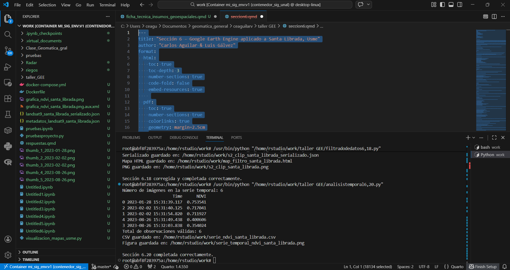{fig-align="center" width="85%"}

# 6.2 Registro y Configuración de Google Earth Engine (GEE)

Se validó el acceso a Google Earth Engine mediante una cuenta de Google y un proyecto activo en Google Cloud. El proyecto utilizado fue:

```python
bamboo-storm-477002-v4
```

La configuración funcional se comprobó mediante la inicialización exitosa de la sesión en Python.

**Resultado:** la conexión con Google Earth Engine quedó habilitada correctamente.

## Evidencia

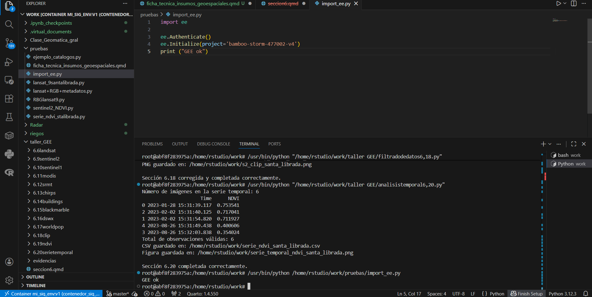{fig-align="center" width="85%"}

# 6.3 Entornos de Ejecución para GEE

Se identificaron los entornos de ejecución disponibles en la guía y se seleccionó la ruta de trabajo realmente utilizada:

- Python en el contenedor del curso
- Quarto para documentación
- QGIS con el plugin de GEE para pruebas de integración
- Consola JavaScript de GEE como apoyo opcional

No se utilizó ArcGIS Pro.

**Decisión metodológica:** concentrar el flujo de trabajo en Python + Quarto + QGIS permitió mantener consistencia técnica y evitar mezclar entornos innecesarios.

## Evidencia

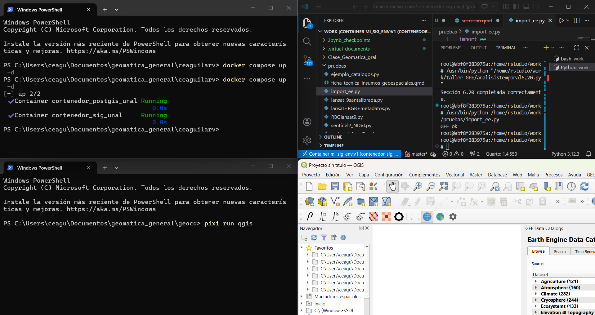{fig-align="center" width="85%"}

# 6.4 Inicialización del Entorno (Python)

La sesión de GEE fue inicializada correctamente en Python con el proyecto del usuario:

```python
import ee

ee.Initialize(project='bamboo-storm-477002-v4')
print("Google Earth Engine se ha inicializado con éxito")
```

## Error encontrado

Al comienzo, la autenticación falló en el contenedor porque Earth Engine intentó usar `gcloud`, pero el binario no estaba disponible.

## Corrección aplicada

Se ajustó el método de inicialización y se usó la forma correcta de inicializar el proyecto con:

```python
ee.Initialize(project='bamboo-storm-477002-v4')
```

También se aclaró que en QGIS/PIXI había que autenticar el entorno por separado, porque no compartía credenciales con el contenedor.

# 6.5 Acceso a los catálogos de GEE

Se revisó la lógica general de acceso a los catálogos de Earth Engine, distinguiendo entre:

- `ee.Image`
- `ee.ImageCollection`
- `ee.FeatureCollection`

Además, se identificaron los *Asset ID* relevantes para el proyecto, entre ellos:

- `LANDSAT/LC09/C02/T1_TOA`
- `COPERNICUS/S2_SR_HARMONIZED`
- `COPERNICUS/S1_GRD`
- `MODIS/061/MOD09A1`
- `USGS/SRTMGL1_003`
- `UCSB-CHG/CHIRPS/DAILY`
- `GOOGLE/Research/open-buildings/v3/polygons`
- `NOAA/VIIRS/DNB/MONTHLY_V1/VCMSLCFG`
- `OPERA/DSWX/L3_V1/S1`
- `WorldPop/GP/100m/pop`

**Conclusión:** esta sección permitió estructurar el trabajo posterior por tipo de dato, resolución y finalidad analítica.

## Evidencia

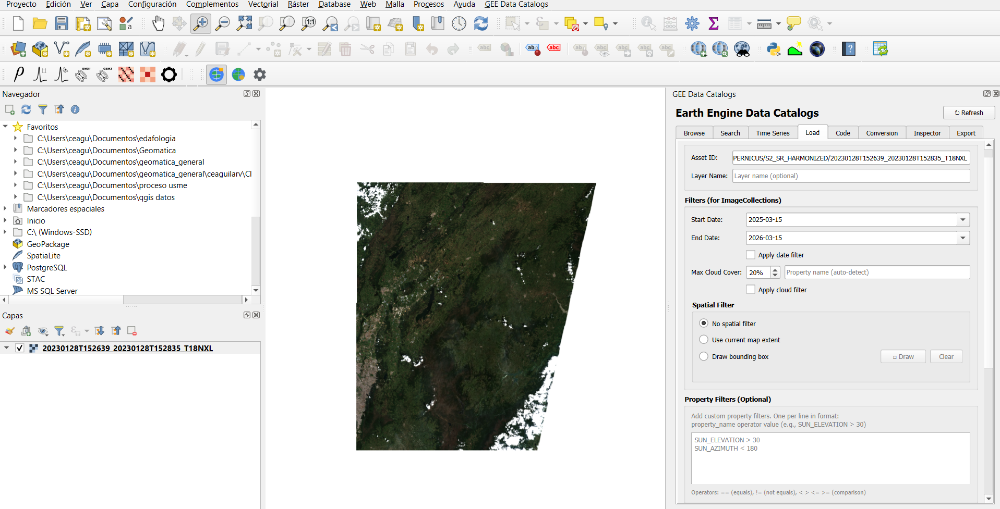{fig-align="center" width="85%"}

# 6.6 Catálogo de datos: Landsat 8/9

Se trabajó con la colección `LANDSAT/LC09/C02/T1_TOA` adaptada a Santa Librada. El flujo incluyó:

- selección de un punto de estudio,
- filtrado por ubicación y por año 2023,
- ordenamiento por nubosidad,
- extracción del identificador exacto de la escena,
- generación de metadatos,
- generación de serializado,
- visualización RGB (`B4`, `B3`, `B2`).

## Productos generados

- `metadatos_landsat9_santa_librada.json`
- `landsat9_santa_librada_serializado.json`
- `map_landsat9_santa_librada.html`
- `landsat9_santa_librada_grilla.png`

## Error encontrado

En QGIS surgió un error al intentar guardar salidas en rutas Linux (`/home/rstudio/work/...`) desde un entorno Windows/PIXI.

## Corrección aplicada

Se explicó que los scripts en el contenedor debían usar rutas Linux, mientras que QGIS requería rutas de Windows. Finalmente, se decidió trabajar los scripts principales desde el contenedor para mantener consistencia.

## Evidencias

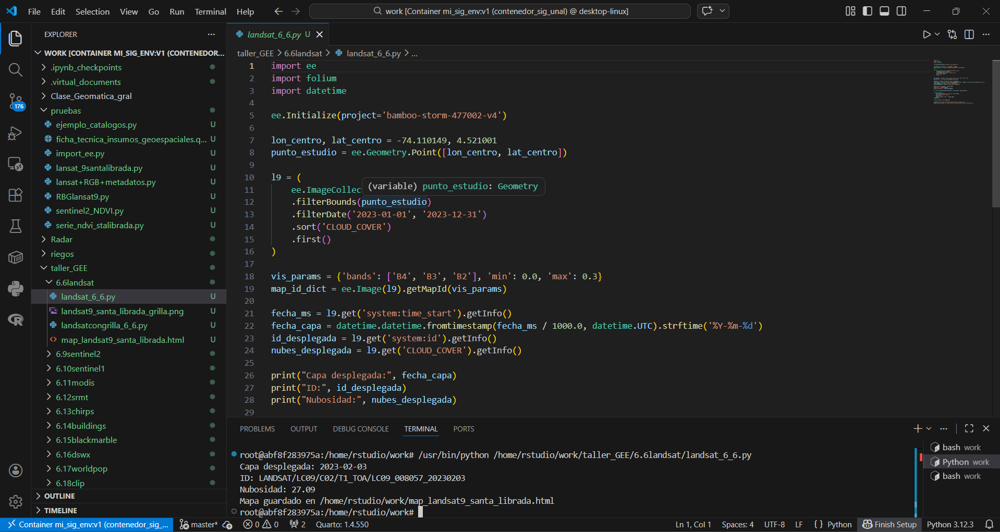{fig-align="center" width="85%"}

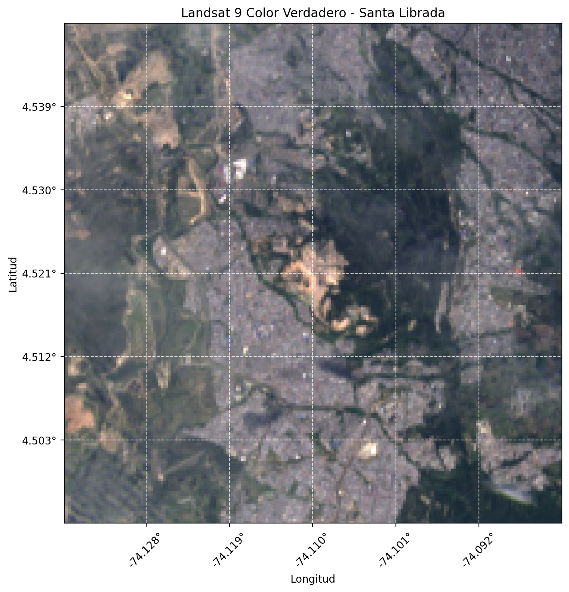{fig-align="center" width="85%"}

# 6.7 GEE desde QGIS (Plugin de Google Earth Engine)

Se integró la imagen Landsat 9 con QGIS mediante el plugin de GEE, usando:

- pestaña **Search** para ubicar la colección,
- pestaña **Code** para ejecutar scripts,
- pestaña **Load** para cargar manualmente capas por Asset ID.

## Error encontrado

El plugin de QGIS arrojó un error de autenticación porque el entorno PIXI no tenía credenciales de Earth Engine.

## Corrección aplicada

Se aclaró que el entorno de QGIS/PIXI era distinto al contenedor y debía autenticarse por separado. Una vez entendido eso, la integración con QGIS quedó funcional.

## Evidencia

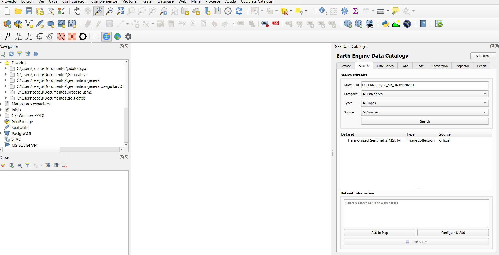{fig-align="center" width="85%"}

# 6.8 GEE desde ArcGIS Pro

Esta subsección no se desarrolló porque el flujo de trabajo elegido se centró en Python, Quarto y QGIS.

# 6.9 Catálogo de datos: Sentinel 2

Se trabajó con `COPERNICUS/S2_SR_HARMONIZED`, adaptando la consulta a Santa Librada. El desarrollo incluyó:

- búsqueda de la mejor imagen de 2023,
- extracción de ID exacto, fecha y nubosidad,
- metadatos,
- serializado,
- mapa HTML,
- salida PNG RGB.

## Productos generados

- `metadatos_sentinel2_santa_librada.json`
- `sentinel2_santa_librada_serializado.json`
- `map_sentinel2_santa_librada.html`
- `sentinel2_santa_librada_rgb.png`

## Evidencias

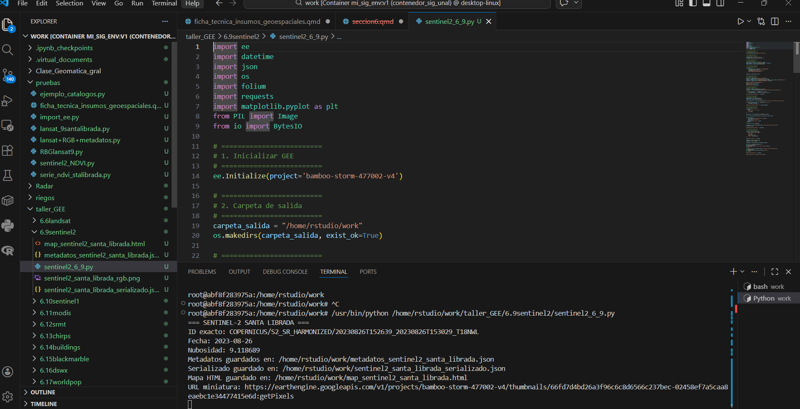{fig-align="center" width="85%"}

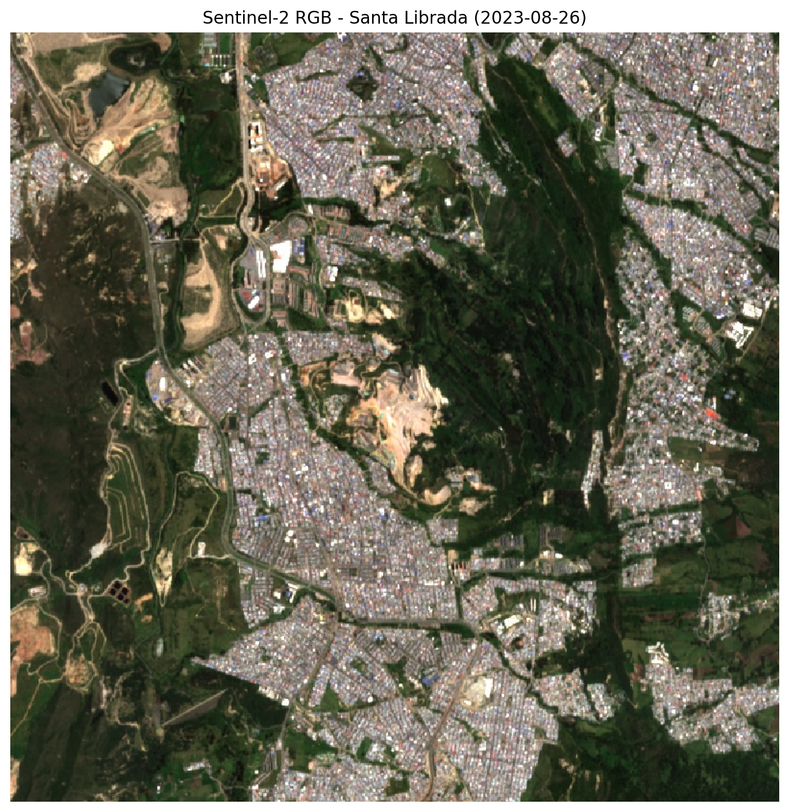{fig-align="center" width="85%"}

# 6.10 Catálogo de datos: Sentinel 1 (SAR)

Se trabajó con `COPERNICUS/S1_GRD`, filtrando por:

- ubicación,
- año 2023,
- polarización `VV`,
- modo `IW`,
- trayectoria descendente.

Se generaron metadatos, serializado, mapa HTML y PNG estático.

## Productos generados

- `metadatos_sentinel1_santa_librada.json`
- `sentinel1_santa_librada_serializado.json`
- `map_sentinel1_santa_librada.html`
- `sentinel1_santa_librada_vv.png`

## Evidencias

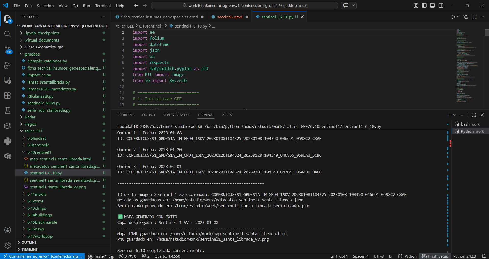{fig-align="center" width="85%"}

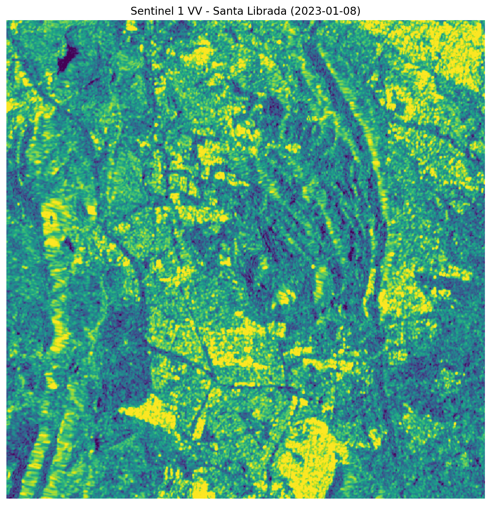{fig-align="center" width="85%"}

# 6.11 Catálogo de datos: MODIS (Terra/Aqua)

Inicialmente se utilizó un producto MODIS diario que produjo salidas muy nubladas.

## Error encontrado

Se usó por error `MODIS/061/MOD09GA`, lo que produjo una imagen excesivamente nublada.

## Corrección aplicada

Se corrigió el dataset para seguir la guía exactamente con:

```python
MODIS/061/MOD09A1
```

que corresponde a un compuesto de 8 días, más estable visualmente.

## Productos generados

- `metadatos_modis_santa_librada.json`
- `modis_santa_librada_serializado.json`
- `map_modis_santa_librada.html`
- `modis_santa_librada_rgb.png`

## Evidencia

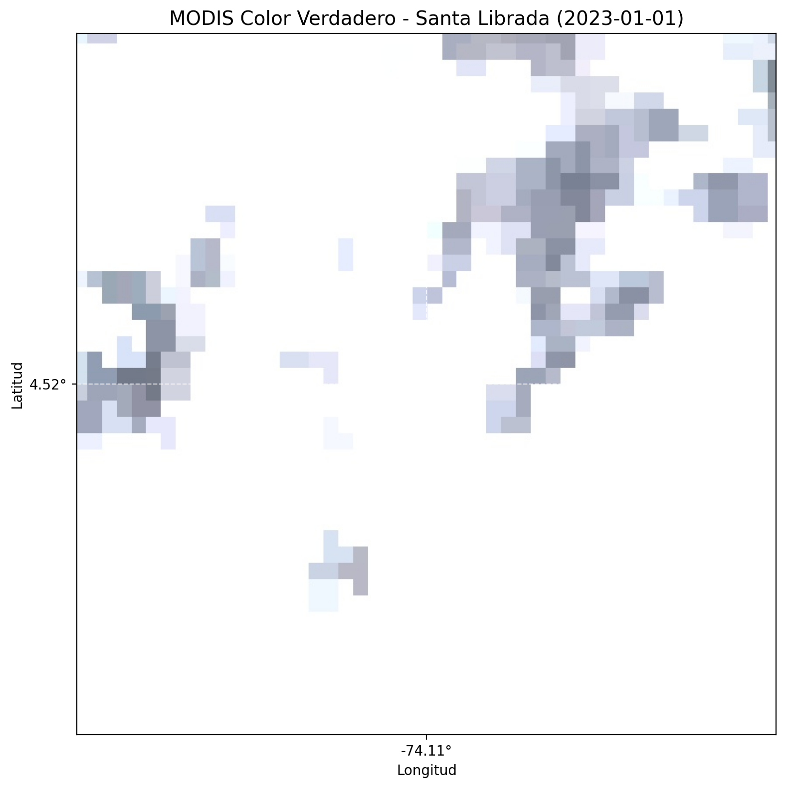{fig-align="center" width="85%"}

# 6.12 Catálogo de datos: SRTM (modelo digital de elevación)

Se trabajó con `USGS/SRTMGL1_003` y se generó un producto de relieve sombreado mediante `ee.Terrain.hillshade(srtm)`.

## Productos generados

- `metadatos_srtm_santa_librada.json`
- `srtm_santa_librada_serializado.json`
- `map_srtm_santa_librada.html`
- `srtm_santa_librada_hillshade.png`

## Evidencia

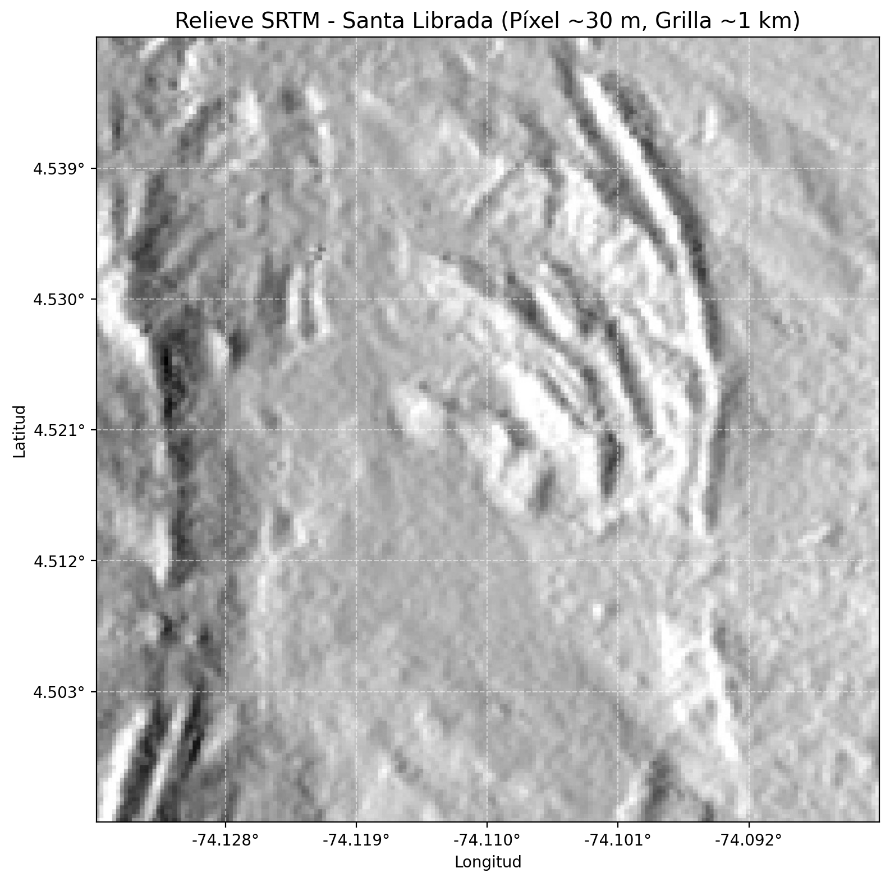{fig-align="center" width="85%"}

# 6.13 Catálogo de datos: CHIRPS (datos de clima / precipitación)

Dado que CHIRPS tiene resolución espacial aproximada de 5.5 km, el análisis se realizó a escala de **Cundinamarca**, siguiendo el espíritu de la guía.

Se trabajó con:

```python
UCSB-CHG/CHIRPS/DAILY
```

filtrando el mes de mayo de 2023.

## Productos generados

- `metadatos_chirps_cundinamarca.json`
- `chirps_cundinamarca_serializado.json`
- `map_chirps_cundinamarca.html`
- `chirps_cundinamarca_precipitacion.png`

## Evidencia

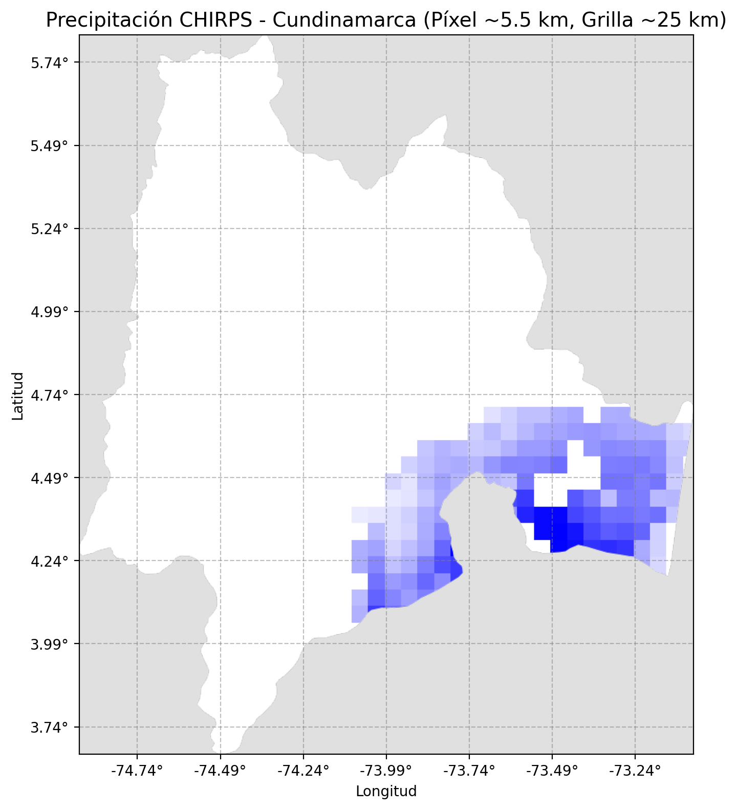{fig-align="center" width="85%"}

# 6.14 Catálogo de datos: 3D Buildings (Google Open Buildings)

Se trabajó con la colección vectorial:

```python
GOOGLE/Research/open-buildings/v3/polygons
```

filtrando la capa al entorno de Santa Librada.

## Productos generados

- `metadatos_buildings_santa_librada.json`
- `buildings_santa_librada_serializado.json`
- `map_buildings_santa_librada.html`
- `buildings_santa_librada.png`

## Integración con QGIS

Se dejó documentado que esta capa se carga en QGIS desde la pestaña **Load** usando el Asset ID como **FeatureCollection** vectorial, no mediante el PNG ni el HTML.

## Evidencias

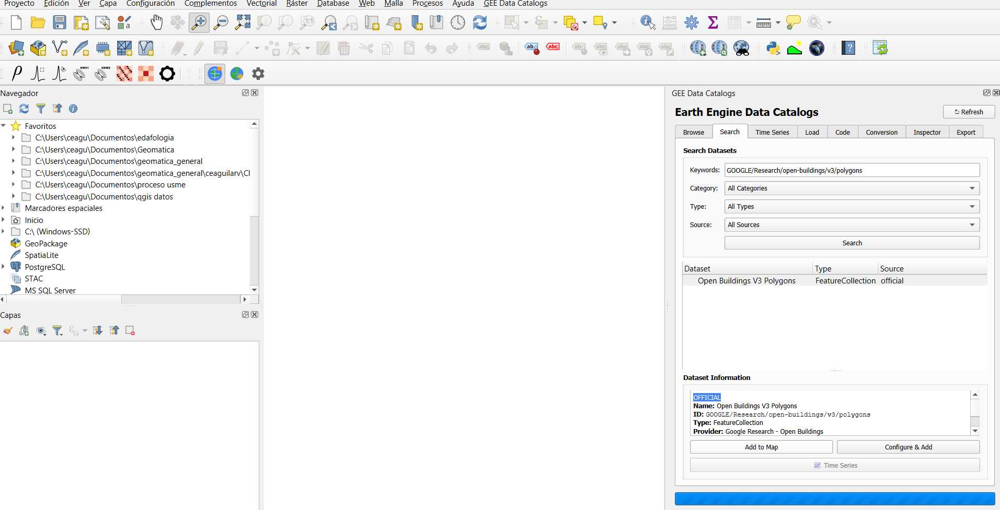{fig-align="center" width="85%"}

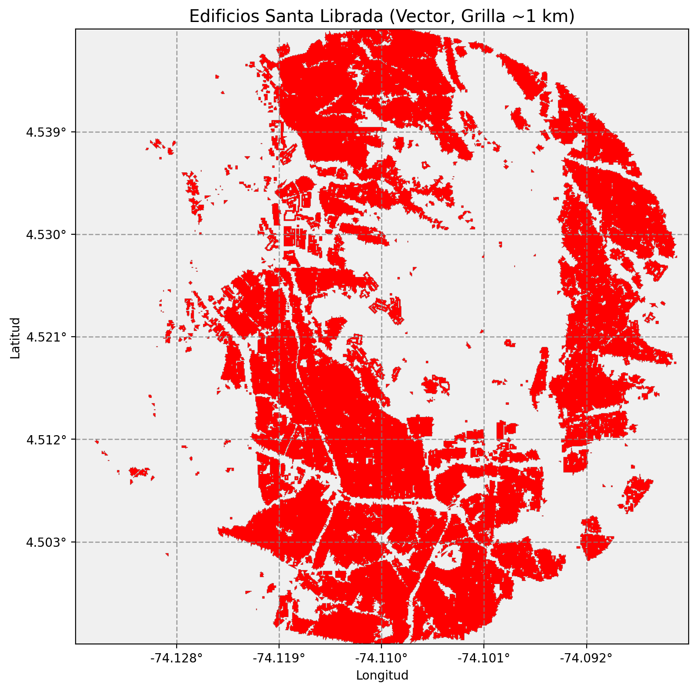{fig-align="center" width="85%"}

# 6.15 Catálogo de datos: BlackMarble (luces nocturnas)

Se trabajó con:

```python
NOAA/VIIRS/DNB/MONTHLY_V1/VCMSLCFG
```

usando la banda `avg_rad` y una visualización con base oscura.

## Productos generados

- `metadatos_ntl_santa_librada.json`
- `ntl_santa_librada_serializado.json`
- `map_ntl_santa_librada.html`
- `ntl_santa_librada.png`

## Evidencia

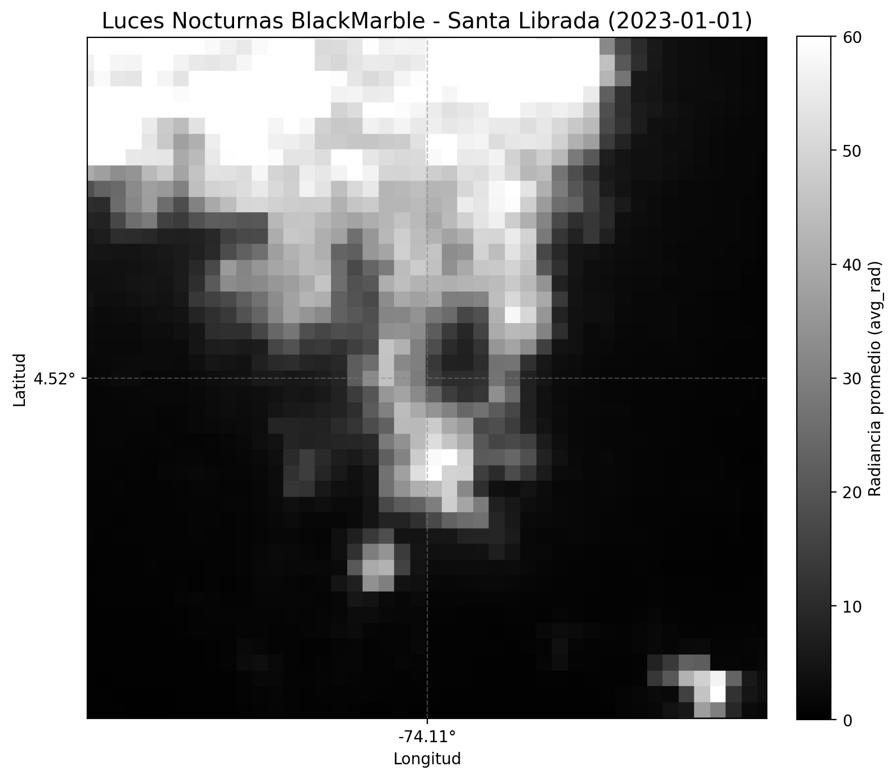{fig-align="center" width="85%"}

# 6.16 Catálogo de datos: DSWx Sentinel-1 (cuerpos de agua)

Se trabajó con:

```python
OPERA/DSWX/L3_V1/S1
```

utilizando la banda `WTR_Water_classification` y una paleta temática para clases de agua/no agua.

## Productos generados

- `metadatos_dswx_santa_librada.json`
- `dswx_santa_librada_serializado.json`
- `map_dswx_santa_librada.html`
- `dswx_santa_librada.png`

## Evidencia

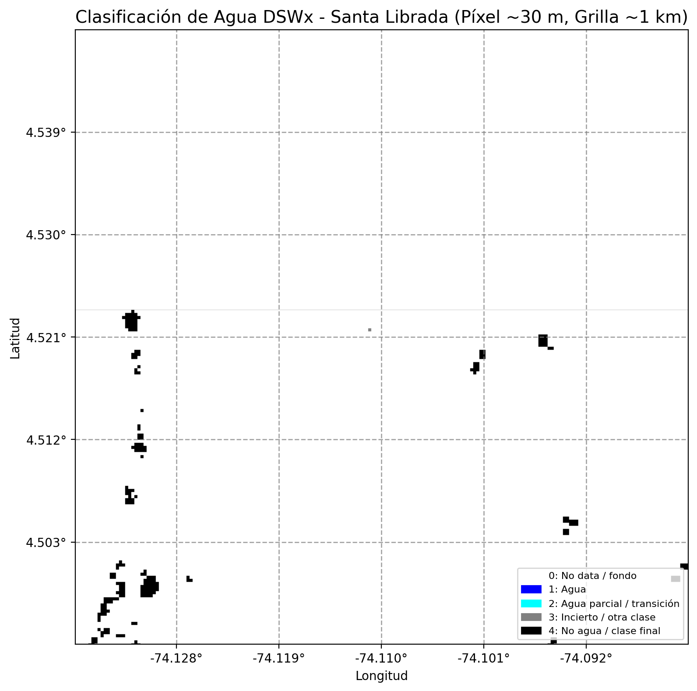{fig-align="center" width="85%"}

# 6.17 Catálogo de datos: WorldPop (población)

Se trabajó con:

```python
WorldPop/GP/100m/pop
```

filtrando por Colombia y recortando visualmente al área de Santa Librada.

## Productos generados

- `metadatos_worldpop_santa_librada.json`
- `worldpop_santa_librada_serializado.json`
- `map_worldpop_santa_librada.html`
- `worldpop_santa_librada.png`

## Evidencia

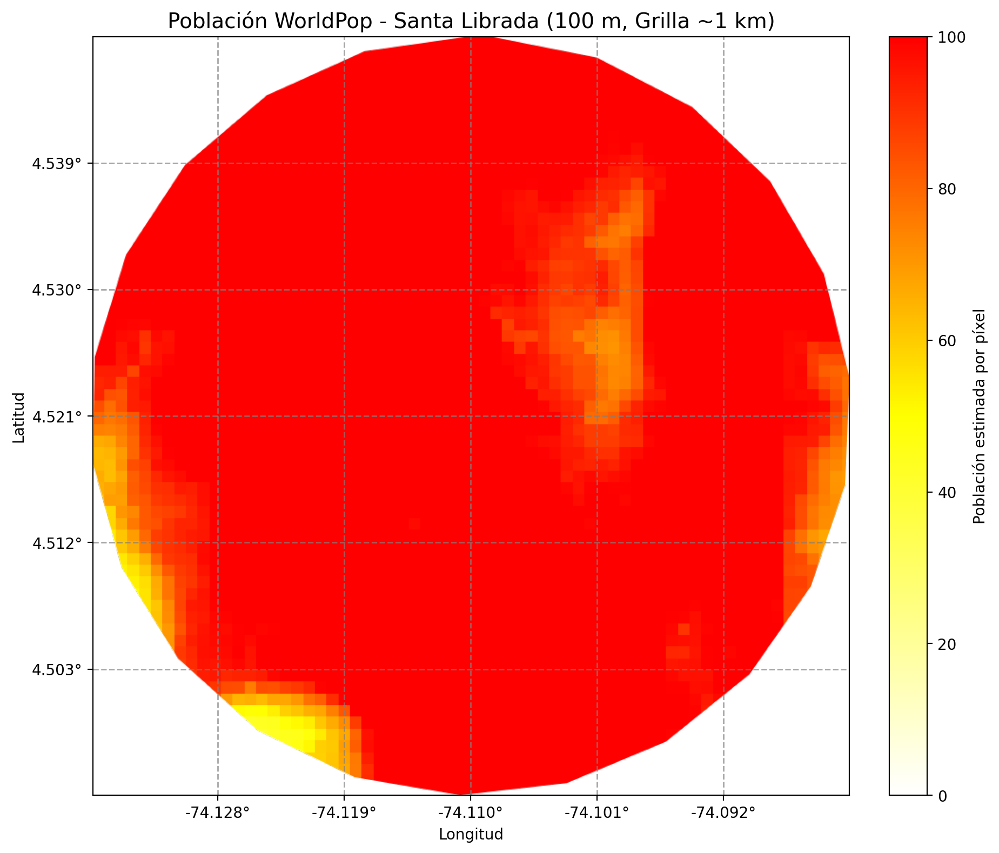{fig-align="center" width="85%"}

# 6.18 Filtrado de datos espaciales y recortes (querying y clipping)

Esta fue una de las secciones donde aparecieron los errores metodológicos más importantes.

## Primer error detectado

Al usar una sola escena Sentinel-2 (`.first()`) y luego aplicar `clip(...)`, el recorte quedaba:

- partido,
- con zonas vacías,
- o desplazado respecto a Santa Librada.

## Causa

El AOI se ubicaba cerca del borde de un tile/cobertura de Sentinel-2. Por lo tanto, la escena base ya llegaba incompleta antes del `clip`.

## Corrección final aplicada

La corrección válida fue:

1. definir un **área de búsqueda más grande**
2. construir un **composite** con `.median()`
3. definir un **área de clip más pequeña**
4. aplicar `clip()` solo al final

La lógica final quedó así:

```python
area_busqueda = punto_estudio.buffer(8000)
area_clip = punto_estudio.buffer(1200).bounds()
coleccion_s2 = ee.ImageCollection(...).filterBounds(area_busqueda)
composite_s2 = coleccion_s2.median()
s2_clip = composite_s2.clip(area_clip)
```

## Productos generados

- `metadatos_s2_clip_santa_librada.json`
- `s2_clip_santa_librada_serializado.json`
- `map_filtro_santa_librada.html`
- `s2_clip_santa_librada.png`

## Evidencias

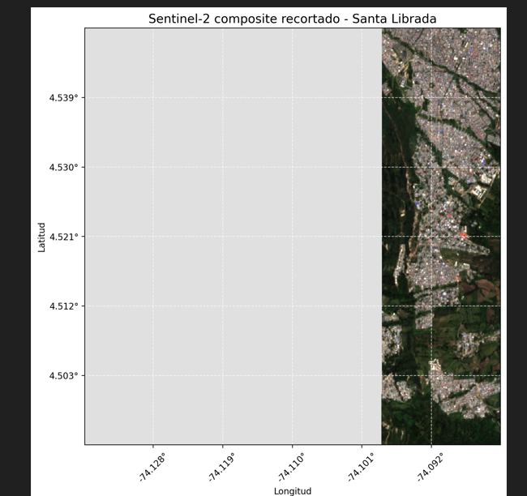{fig-align="center" width="85%"}

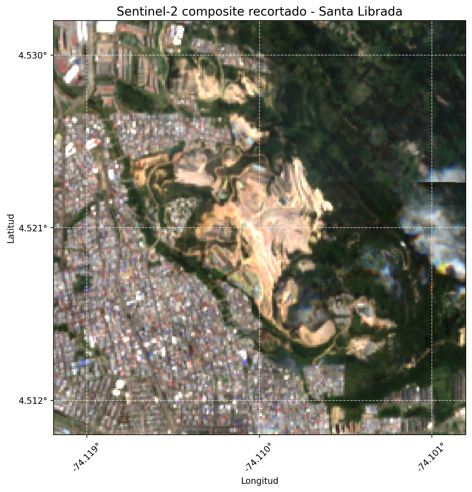{fig-align="center" width="85%"}

# 6.19 Índices espectrales (NDVI)

Esta sección también requirió una corrección importante.

## Primer error detectado

Al calcular el NDVI sobre una sola escena Sentinel-2, el resultado se veía “partido” sobre Bogotá, y Santa Librada no aparecía bien calculada.

## Causa

De nuevo, el problema era el borde de cobertura de una sola escena. El NDVI no estaba mal calculado; simplemente la escena no cubría bien toda la región visualizada.

## Corrección final aplicada

La solución fue:

1. usar una **colección Sentinel-2** filtrada por un área de búsqueda mayor,
2. construir un **composite** con `.median()`,
3. calcular el NDVI sobre el composite,
4. **no aplicar `clip()` al NDVI analítico**,
5. enfocar la visualización sobre Santa Librada para que el HTML y el PNG fueran legibles.

La lógica final fue:

```python
coleccion_s2 = ee.ImageCollection(...).filterBounds(region_interes)
composite_s2 = coleccion_s2.median()
ndvi = composite_s2.normalizedDifference(['B8', 'B4']).rename('NDVI')
```

## Productos generados

- `metadatos_ndvi_composite_santa_librada.json`
- `ndvi_composite_santa_librada_serializado.json`
- `map_ndvi_composite_santa_librada.html`
- `ndvi_composite_santa_librada.png`

## Evidencias

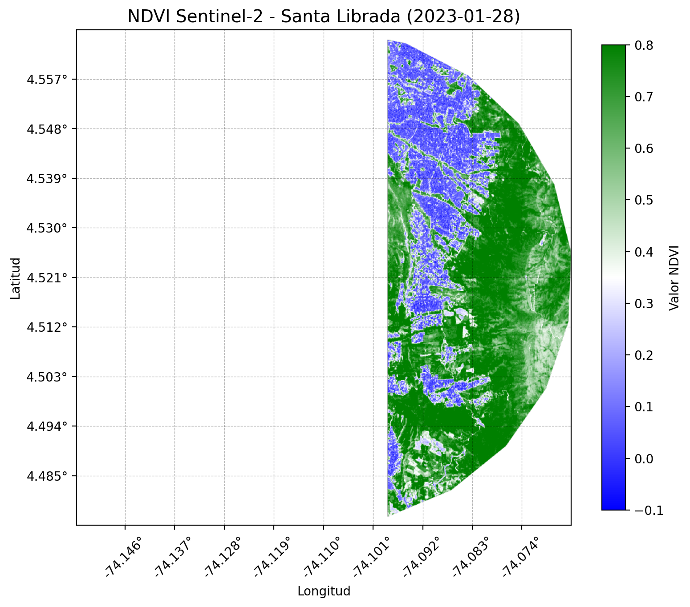{fig-align="center" width="85%"}

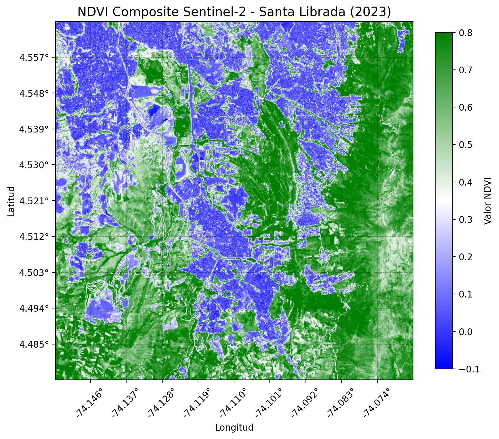{fig-align="center" width="85%"}

# 6.20 Análisis temporal y galería visual

Se construyó una serie temporal de NDVI medio para Santa Librada usando Sentinel-2 en 2023. Para evitar problemas de cobertura parcial, la serie se construyó sobre un **área de búsqueda más amplia** que el área puntual de análisis.

## Flujo seguido

1. filtrar Sentinel-2 por fecha, área y nubosidad
2. agregar una banda NDVI a cada imagen
3. extraer el valor medio por fecha con `reduceRegion(..., ee.Reducer.mean())`
4. guardar la tabla en CSV
5. construir la figura con curva temporal y filmstrip de 5 imágenes RGB

## Productos generados

- `serie_ndvi_santa_librada.csv`
- `serie_temporal_ndvi_santa_librada.png`

## Observación metodológica

La guía advierte que cambios aparentes en la serie pueden deberse a nubosidad residual o condiciones atmosféricas, por lo que la lectura de la curva debe hacerse junto con la galería visual.

## Evidencia

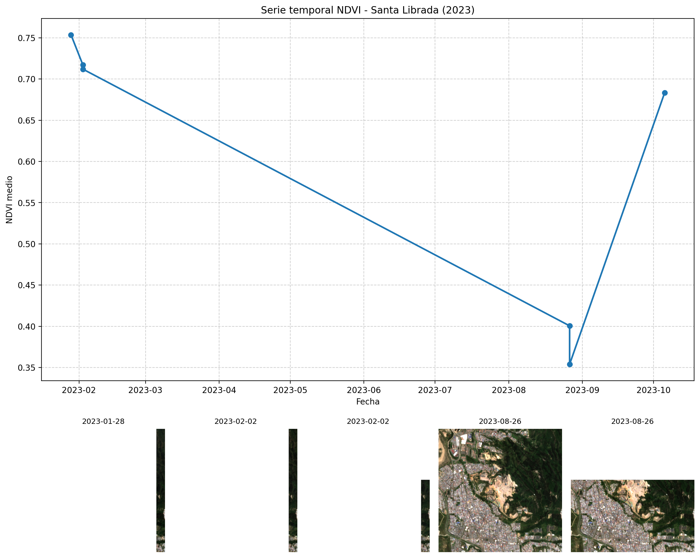{fig-align="center" width="85%"}

# 6.21 Entregables y criterios de evaluación

## Entregable 1. Documento Quarto

Este documento constituye el principal entregable textual, al integrar:

- el desarrollo de las subsecciones,
- la adaptación a Santa Librada,
- los productos generados,
- los errores encontrados,
- y las correcciones metodológicas aplicadas.

## Entregable 2. Respuestas teóricas

### ¿Cómo se integra Google Earth Engine con software SIG de escritorio?

Google Earth Engine se integra con software SIG de escritorio a través de plugins, APIs y servicios que permiten consultar, visualizar y complementar datos procesados en la nube dentro de entornos locales como QGIS. En este trabajo, la integración se realizó principalmente mediante el plugin de GEE en QGIS, lo que permitió conectar el análisis en la nube con herramientas de visualización cartográfica de escritorio.

### ¿Por qué son importantes los filtros espaciales, temporales y temáticos?

Estos filtros permiten limitar una gran colección de datos a un subconjunto realmente pertinente. El filtro espacial restringe la consulta al área de estudio; el temporal selecciona el periodo relevante; y el temático permite conservar únicamente escenas que cumplen ciertos criterios, como nubosidad baja. En conjunto, mejoran la precisión, reducen ruido y optimizan el análisis.

### ¿Por qué es importante comprender funciones como `filterBounds`, `filterDate`, `clip` o `normalizedDifference`?

Porque son funciones estructurales del análisis en Earth Engine. `filterBounds` y `filterDate` permiten seleccionar el subconjunto espacial y temporal adecuado; `clip` recorta la información a un polígono de interés; y `normalizedDifference` hace posible construir índices espectrales como el NDVI. Dominar estas funciones permite desarrollar flujos de trabajo reproducibles y correctamente interpretados.

# 6.22 Glosario de funciones de Google Earth Engine (GEE)

## `ee.Initialize(project=...)`

Inicializa la sesión de Earth Engine asociada a un proyecto de Google Cloud.

## `ee.Geometry.Point([lon, lat])`

Crea un punto geográfico a partir de coordenadas en formato longitud-latitud.

## `ee.ImageCollection("...")`

Permite cargar una colección de imágenes satelitales o raster.

## `ee.FeatureCollection("...")`

Permite cargar una colección vectorial de entidades espaciales.

## `.filterBounds()`

Filtra una colección para conservar únicamente los elementos que intersectan un área geográfica.

## `.filterDate()`

Filtra una colección según un intervalo temporal definido.

## `.filter(...)`

Aplica filtros temáticos adicionales, por ejemplo de nubosidad o propiedades internas.

## `.median()`

Genera un composite píxel a píxel usando la mediana de una colección. Fue fundamental para corregir problemas de cobertura parcial en Santa Librada.

## `.clip()`

Recorta una imagen a una geometría. En este trabajo se usó solo cuando la sección realmente exigía un recorte analítico.

## `.normalizedDifference(['B8','B4'])`

Calcula la diferencia normalizada entre dos bandas y se utilizó para construir el NDVI.

## `.reduceRegion()`

Resume valores de una imagen dentro de una región, por ejemplo calculando el promedio del NDVI.

## `.serialize()`

Convierte un objeto de Earth Engine en una representación serializada, útil para documentación, interoperabilidad y persistencia.

# Conclusiones generales

El desarrollo de la Sección 6 permitió adaptar un conjunto amplio de ejercicios de Google Earth Engine al caso real de **Santa Librada, Usme**, integrando sensores ópticos, radar, modelos de elevación, datos climáticos, población, edificios y productos derivados. Más allá de la ejecución técnica, el proceso mostró la importancia de la **lectura crítica de resultados**, especialmente cuando se trabaja con una sola escena satelital en zonas cercanas a bordes de tile.

Las correcciones aplicadas en 6.18 y 6.19 evidenciaron que no siempre basta con usar `.first()` y visualizar el resultado: en algunos casos fue indispensable construir **composites** sobre un área de búsqueda más amplia y luego recortar o enfocar la visualización en Santa Librada. Esto fortaleció el valor metodológico del trabajo y dejó un precedente claro para futuras prácticas y para la redacción final del informe.
